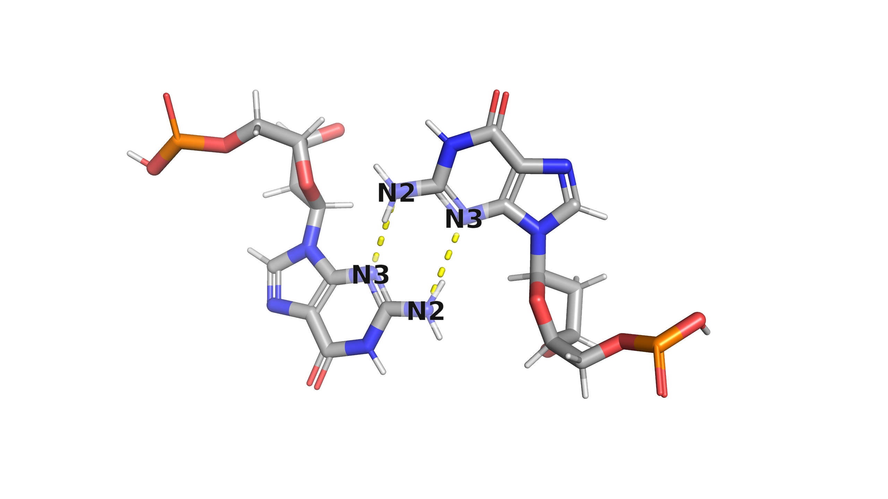
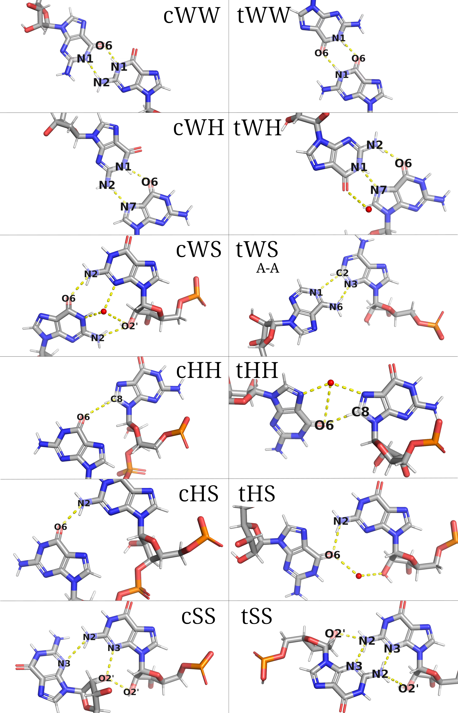
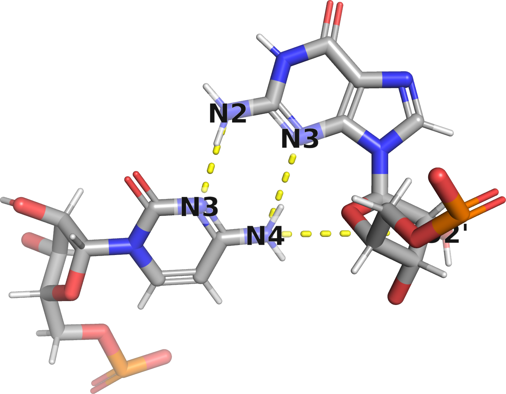

## Classification of Basepairs{#sec:bp-terminology}

### Saenger System {#sec:bp-terminology-seanger}

 book, page 120](../img/saenger-system-merged.png){#fig:saenger-system-merged}

Since many different non-canonical base pairs exists, a systematic naming scheme is necessary.
The first such scheme we are aware of was described by [W. Saenger in the book 'Principles of Nucleic Acid Structure' (1984)](https://doi.org/10.1007/978-1-4612-5190-3), where he identified and classified possible base pairs with at least two hydrogen bonds into 28 distinct classes.
The Saenger's classes are identified using a single ordinal number and are grouped into five higher-level categories based on geometrical symmetry and pairing bases.


### The Leontis-Westhof System of Three Edges {#sec:bp-terminology-lw}

[N. B. Leontis and E. Westhof proposed a more systematic approach in a 2001 paper](https://doi.org/10.1017/s1355838201002515).
The authors identified that each nucleotide interacts with one of its three edges (@fig:LW-3-edges-UG).
The _front edge_ is called **“Watson-Crick”**, since this is the only edge involved in the canonical base pairing.
The two _side edges_ are called **“Hoogsteen”** and **“Sugar”** -- the former is involved in the Hoogsteen pairs and the latter covalently bonds with the ribose sugar.
The base pairs are classified based on the two interacting edges and their relative orientation (cis or trans).

{#fig:LW-3-edges-UG}

A pair of edges still leaves two possible conformations: either the indicated edge arrows point in opposite directions or they are parallel (i.e., one base is flipped).
Such change usually results in different sets of hydrogen bonds, and a distinct shape of the nucleic acid backbone.
The Leontis-Westhof naming system labels one conformation **cis** and the other **trans**, based on the direction of the N-C1' bonds.
Generally, **cis** pairs have the N-C1' bonds pointing in a similar direction, while **trans** pairs orient them in opposite directions.
However, there is not a strict 90° limit on their angle; instead, we label a conformation as **cis** if it has a more acute angle than the corresponding **trans** conformation (see example of **cHH AG** vs. **tHH AG** in fig. TODO).
All 12 basepair families are shown in figure [-@fig:LWS-all-families-G-G], the order in which the base pairs are listed is determined by a historically based priority rule: Watson–Crick edge > Hoogsteen edge > Sugar edge <https://doi.org/10.1017/s1355838201002515>.

[Leontis and Westhof](https://doi.org/10.1017/s1355838201002515) define **cis** and **trans** as:

> A given edge of one base can potentially interact in a plane with any one of the three edges of a second base, and can do so in either the cis or trans orientation of the glycosidic bonds (this nomenclature was used before, see, e.g., [Sundaralingam, 1977](https://doi.org/10.1002/qua.560120704)).
> The cis and trans orientations, which follow the usual stereochemical meanings, are illustrated in the right panel of Figure 1 TODO for two bases interacting with their Watson–Crick edges.

The **cis** and **trans** prefixes only indicate the orientation of the base edges relative to each other, not whether the pairing helix is parallel or antiparallel, although there is a correlation.
Canonical A-T, A-U, and G-C basepairs are **cis** Watson-Crick/Watson-Crick with antiparallel strands.
For instance, **trans** Watson-Crick G-G can also occur in antiparallel strands (see the [`4pmi`](https://www.rcsb.org/structure/4pmi) PDB structure).
Some basepair types may appear in both parallel and antiparallel strands, depending on the sugar-base conformation being **syn** or **anti**.
The [“Strand Orientation” table at NAKB](https://www.nakb.org/basics/basepairs.html#LW/) is thus not entirely accurate, as it only indicates typical case. 

Basepair names are commonly abbreviated using 3-letter codes -- **c** or **t** for cis or trans, and **W**, **H** or **S** for each of the two edges (**W**atson-Crick, **H**oogsteen, and **S**ugar).
Since pairing conformation also depends on the bases involved, we include the base letters (A, T, U, G, C) to specify the sequence.
For example, we refer to the pairs in @fig:LWS-all-families-G-G as **cWW G-G**, **tWW G-G**, ... **tSS G-G**.

<!-- **Cis** basepairs have the pairing edge arrows oriented in parallel, while **trans** basepairs have edges in opposing direction.

However, to pair in **cis**, the bases must be flipped -->

Note that “Sugar” refers to the name of a purine or pyrimidine edge, which does not necessarily imply interaction with the ribose sugar, although it is common in RNA.
Fig. [-@fig:tSS-GG-DNA-6n4g-A_2-B_2-no-oxygens] shows a **DNA** Sugar/Sugar pair without any ribose interaction.
In RNA, the ribose O2' oxygen can interact with the other base or even the other O2' oxygen.
Since it is an OH group, it can function both as a hydrogen bond donor and acceptor, for instance in the **cSS G-G** class (@fig:LWS-all-families-G-G).

{#fig:tSS-GG-DNA-6n4g-A_2-B_2-no-oxygens .img-width50}

<!-- A frequent misconception is that "Sugar" means the base binds to the ribose oxygen.
Although this is frequently the case that the base pair **includes** a hydrogen bond to the O2' atom, it is definitely not necessary.
The Sugar edge is primarily meant as one of purine/pyrimidine faces and most of the defined base pairs including the Sugar edge bind to an atom on the base, often the N3 purine atom.
The corner atoms are included in the definition of both edges -- for instance, the N2 guanine atom is shared between the Sugar and Watson-Crick edges. ???

Some base pairs defined by Westhof and Leontis do bind exclusively to the O2' ribose atom. -->

{#fig:LWS-all-families-G-G}

<!-- SVGčko nefunguje?? -->

### M-N/M+N DSSR Labels

The software tool X3DNA DSSR (see also @sec:software-DSSR) employs a distinct scheme for differentiating **cis** and **trans** orientations.
Instead of following the angle between the C1'-N bonds, [DSSR considers whether the bases are flipped relative to their **Z** axis](https://x3dna.org/articles/specification-of-base-pairs-in-3dna).
If the base **Z** axes are aligned, DSSR labels the basepair as `M+N`; if the bases are flipped, it is labeled `M-N`.
`M` and `N` are placeholders for any combination of A, T, U, G, C -- for example, the canonical pairs are labeled `G-C` and `A-U`.
In terms of the three edges discussed earlier, a basepair is classified as `M-N` if the edge arrows in @fig:LW-3-edges-UG point in the same direction; if they are opposite, it is classified as `M+N`.
Note that DSSR does not consider base edges, defining basepairs solely by the relative positions of the base coordinate systems, see @sec:std-base-parameters for more details.

The following block is an example DSSR output -- we can see the `-`/`+` and trivial basepair names in the last two columns (small `u` indicates a modified base).

```
12   23  # o  26 A.U12    A.A23  U-A  WC
13   22  # o  27 A.C13    A.G22  C-G  WC
14    8  # o  28 A.A14    A.U8   A-U  rHoogsteen
15   48  # o  29 A.G15    A.C48  G+C  rWC
16   59  # o  30 A.H2U16  A.U59  u+U  --
```

### Trivial Basepair Names

Some classes of basepairs have trivial (popular) names, which generally predate any attempts to systematize the terminology.
Apart from the Watson-Crick canonical pairs, important ones include the Wobble (**cWW GU**), Hoogsteen (**cWH UA**), and Reverse Hoogsteen (**tWH UA**, **tWH UC**) basepairs.
For a complete translation table between the trivial, Leontis-Westhof, and Saenger names, refer to Table 2 in <https://doi.org/10.1017/s1355838201002515>.

### Comparison

The Leontis-Westhof system is more general, we can observe 122 of the base pairs in high quality X-ray structures deposited in the PDB.
The Saenger system is more restrictive, as it only includes the basepairs that have at least two hydrogen bonds between two polar base atoms.
Although one could argue that the other pair types do not form “real” basepairs, it is noteworthy that the Saenger system also overlooks certain base pairs that meet the criteria.
For instance, the **tWS CG** basepair shown in @fig:tWS-CG-1jj2-9_46-9_4 satisfies the condition, yet it is not included in @fig:saenger-system-merged.

{#fig:tWS-CG-1jj2-9_46-9_4 .img-width50}

<!-- We have not seen a recent publication using the Saenger's scheme, but the neither the Leontis-Westhof system is universally adopted.
It is more general and maybe more importantly it is systematic -- we don't need to remember 28 numbers to be able to identify the basepair type when viewing a molecular structure. -->

<!-- Being more general, the L-W system includes pairs which some might not want to call "base pairs".
A number of described base pairs only bind with a single hydrogen bonds or requires binding to ribose O2', restricting the class to RNA.
However, a few of doubly bonded legitimate base pairs are missing in the Saenger system, for instance the XX. -->


