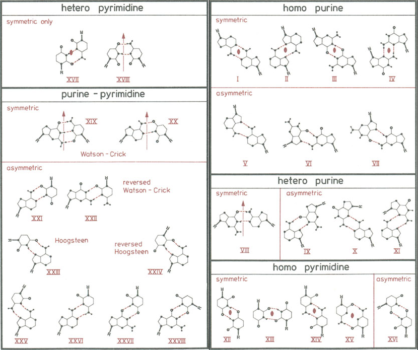

## Basepair type terminology

### Saenger system {.unnumbered}

Since many different non-canonical base pairs exists, a systematic way naming scheme is needed.
The first naming scheme we know about was described by W. Saenger in the Principles of Nucleic Acid Structure book published in 1984 [TODO cite].
Seanger identified possible base pairs with at least 2 hydrogen bonds and sorts them into 28 distinct classes.
The classes are identified only be an ordinal number, but ordered the classes.

### System of three edges {.unnumbered}

A more systematic approach was proposed (by N. B. Leontis and E. Westhof in a paper published in 2001)[https://pubmed.ncbi.nlm.nih.gov/11345429].
The authors identified that each of the two nucleotides interacts with one of its three edges.
The “front edge” is called **“Watson-Crick”**, since this is the only edge involved in the canonical base pairing.
The two side edges are called **“Hoogsteen”** and **“Sugar”** -- the former is involved in the Hoogsteen pairs and the latter covalently bonds with the ribose sugar.
The base pairs are named by the two interacting edges, and their relative orientation (cis, trans).

A pair of edges still leaves two possible conformations -- either the indicated edge arrows point in opposite directions, or they are parallel if we flip one of the bases.
Usually, this results in a different set of hydrogen bonds, and it will require different shape of the nucleic acid backbone.
The Leontis-Westhof naming system calls one conformation **cis** and the other **trans**, based on the direction of the N-C1' bonds.
Generally, **cis** pairs have the N-C1' bonds pointing in a similar direction, while **trans** pairs orient them in the same direction.
However, there isn't any specific 90° limit on their angle, we instead label **cis** the conformation which is more acute angle than the **trans** conformation.
There exist basepairs where both angles can be above 90°, albeit only slightly in case the **cis** conformation.

The **cis** and **trans** prefixes only indicate which way the bases face each other, it does not indicate if the pairing helix is parallel or antiparallel, although it correlates.
Canonical basepairs are **cis** Watson-Crick G-C and A-T with antiparallel strands.
For example, **trans** Watson-Crick G-G also form antiparallel strands (see the [`4pmi`](https://www.rcsb.org/structure/4pmi) PDB structure).
The ["Strand Orientation" NAKB table](https://www.nakb.org/basics/basepairs.html#LW/) is ~~wrong~~ only indicating the typical case. 

<!-- **Cis** basepairs have the pairing edge arrows oriented in parallel, while **trans** basepairs have edges in opposing direction.

However, to pair in **cis**, the bases must be flipped -->

Note that “Sugar” is a name of the purine or pyrimidine edge -- it does not necessarily mean that the pairing base is interacting with the ribose sugar, although it is frequently the case.
In RNA, we often find the ribose O2' oxygen interacting in base pairing.
Since it is an OH group, it can act either as H-bond donor or acceptor.

TODO Show example image of tSS GG + something that needs the O2'

<!-- A frequent misconception is that "Sugar" means the base binds to the ribose oxygen.
Although this is frequently the case that the base pair **includes** a hydrogen bond to the O2' atom, it is definitely not necessary.
The Sugar edge is primarily meant as one of purine/pyrimidine faces and most of the defined base pairs including the Sugar edge bind to an atom on the base, often the N3 purine atom.
The corner atoms are included in the definition of both edges -- for example, the N2 guanine atom is shared between the Sugar and Watson-Crick edges. ???

TODO tSS GG

Some base pairs defined by Westhof and Leontis do bind exclusively to the O2' ribose atom.
However, this is the exception to the rule, and it makes us ask whether we shouldn't call these pairs "nucleotide pairs" instead of "base pairs". -->

Example: cWW GC, tWW GC

The names are commonly shortened to 3-letter codes -- `c` or `t` for cis or trans, and `W`, `H` or `S` for each of the 2 edges.
`W` is Watson-Crick, `H` Hoogsten and `S` is the Sugar edge.
Since the pairing conformation depends on the pairing bases as well, we include the `A`, `T`, `U`, `G`, or `C` letters to identify the sequence.
For example, we can say that the image above shows the `cWW GC` and `tWW GC` pairs.

### Comparison {.unnumbered}

The Leontis-Westhof system is more general, we can observe 122 of the LW base pairs in high quality X-ray structures deposited in PDB.
The Saenger system only includes the basepairs with at least two H-bonds between two polar base atoms.
While it could be argued that the other pair types are not “real basepairs”, the Saenger system also, for example, misses the **tWS CG** basepair which satisfies the condition.

As far as we are aware, all publications today use the newer Leontis-Westhof system.
It is more general and maybe more importantly it is systematic -- we don't need to remember 28 numbers to be able to identify the basepair type when viewing a molecular structure.

<!-- Being more general, the L-W system includes pairs which some might not want to call "base pairs".
A number of described base pairs only bind with a single hydrogen bonds or requires binding to ribose O2', restricting the class to RNA.
However, a few of doubly bonded legitimate base pairs are missing in the Saenger system, for example the XX. -->

