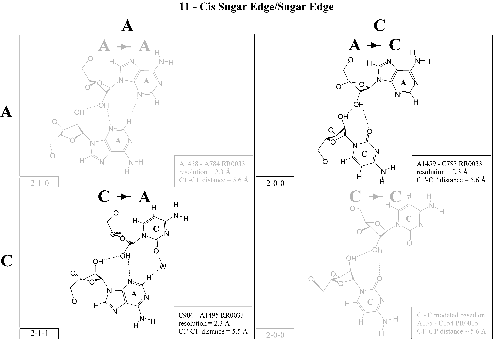
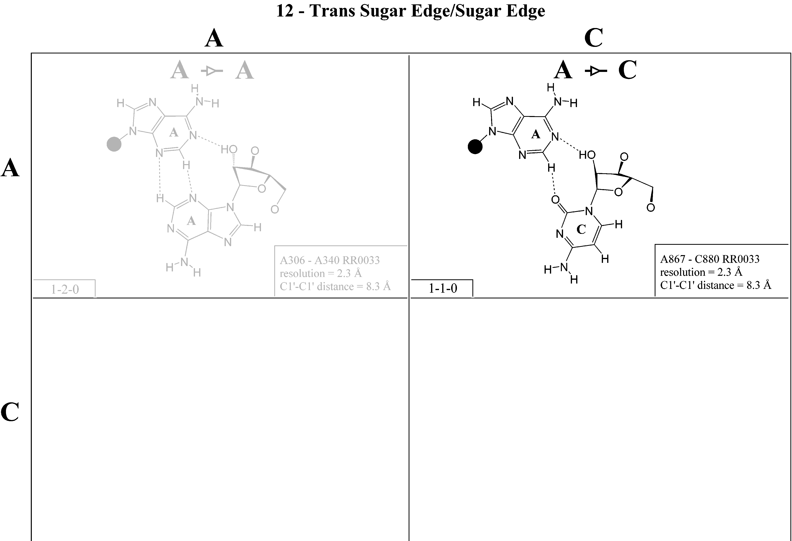

## Special Cases of the Leontis-Westhof Naming Scheme {#sec:bp-terminology-lw-edgecase}

### Symmetry of L-W Classes

As presented in the previous section, the L-W scheme theoretically distinguishes 156 distinct base pair conformations, when treating uracil as equivalent to thymine. <!--TODO this is maybe interesting-->
On each side of the pair, there are three options for the edge and four options for the nucleotide, resulting in a total of twelve unique combinations.
We can create a $12 \times 12$ matrix of base-edge combinations.
Assuming symmetry between pairs, such as **cWH A-G** being equivalent to its flipped counterpart **cHW G-A**, we count the number of elements in the lower triangular matrix, ignoring all entries above the diagonal.
This results in $12 + 11 + \cdots + 1 = 78$ unique combinations.
Given that each base-edge couple can pair in either **cis** or in **trans** conformation, we multiply this by an additional two options, resulting in a total of 156 possibilities.

It is evident that not all theoretically possible pairs can make sense chemically.
For instance, the Hoogsteen edge of a cytosine consists of single NH2 group, which can only act as hydrogen bond donor.
Thus, **cHH C-C** basepair, involving only this edge, cannot provide a stabilizing base interaction.

<!-- The conformation is different for each of the four nucleotides.
We have the following choices:

* **cis** or **trans**
* **pair** of **nucleotides**, choice of 2 out of 4
* **pair** of **edges**, choice of 2 out of 4

Since both choices allow repetitions (`A` can pair with another `A`), we calculate the number of options as $\binom{n + 1}{2}$ (https://en.wikipedia.org/wiki/Combination#Number_of_combinations_with_repetition).
Since the numbers are small, we can alternatively count the number of options using a simple table.

However, we have to account for the fact that some pairs are symmetric to each other and avoid double counting these.
For example, the `cWW GC` is the same pair as `cWW CG`.
Generally, we should avoid counting a pair if swapping the order of edges and the order of nucleotides yields a pair which was counted already.
We will first avoid edge combinations marked as duplicate:

| - | W | H | S |
|---|---|---|---|
| W | 1 | Dup | Dup |
| H | 2 |  3  | Dup |
| S | 4 |  5  |  6  |

This leaves with 6 edge combinations, 3 symmetric and 3 asymmetric.
If the edge combination is asymmetric, we can count all 16 nucleotide combinations.
If is it symmetric, we can only count the 10 unique nucleotide combinations:

| - | A | T   | G   | C   |
|---|---|---|---|--|
| A | 1 | Dup | Dup | Dup |
| T | 2 |  3  | Dup | Dup |
| G | 4 |  5  |  6  | Dup |
| C | 7 |  8  |  9  | 10  |

When we add these and multiply by 2 to account for the **cis** or **trans** choice, we get:

$$2 \cdot \left( 16 \cdot 3 + 10 \cdot 3 \right) = 156$$ -->

### Sugar-Sugar Symmetry

Unfortunately, the assumption of symmetry we made earlier is generally invalid.
Many Sugar-Sugar basepairs are not defined asymmetrically, such as **cSS A-C** which is not a flipped version of **cSS C-A**.
All six “symmetric” pairs are defined differently in **cis** Sugar/Sugar, and only one in **trans** Sugar/Sugar (G-A/A-G). <!--TODO Ref-->

This property isn't explicitly mentioned in [Leontis, Westhof 2001](https://doi.org/10.1017/s1355838201002515) (TODO verify again), however the tables of examples in [Leontis 2002](https://doi.org/10.1093/nar/gkf481) clearly show different base pairing for the two cases.

Leontis and Westhof also propose a glyph symbols for each base pair family:
Watson-Crick edge as a circle (`○`), Hoogsteen edge as square (`□`) and sugar edge as an triangle (`▷`).
If the basepair is **cis**, the shape is filled (`●`, `■`, `▶`), if **trans**, it is empty (`○`, `□`, `▷`).
The basepair families are then `⎼○⎼` (or `○⎼○`) for **tWW**, `●⎼▶` for **cWS** and `⎼▶⎼` **cSS**.
Note that only the sugar edge has an asymmetrical glyph symbol, indicating the authors' original intention to have the Sugar/Sugar family asymmetric.

If the basepair is **cis**, it is represented with filled symbols (`●`, `■`, `▶`); if **trans**, it is shown with empty symbols (`○`, `□`, `▷`). The resulting basepair families are then represented as `⎼○⎼` (or `○⎼○`) for **tWW**, `●⎼▶` for **cWS**, and `⎼▶⎼` for **cSS**. Note that only the sugar edge has the asymmetrical glyph symbol.

Section [-@sec:software] discusses available software tools more thoroughly; however, it is worth noting here how FR3D disambiguates the two **cSS** cases by lowering the second `S` letter.
FR3D reports all basepair in both orientations -- A **cSs A-C** pair is also reported as the corresponding **csS C-A** pair, both meaning **cSS A-C** in the Leontis-Westhof terminology.

<!-- ■⎼▶
□⎼▷
○⎼● -->

### Symmetric false friends — cWW A-A vs tWW A-A

trans Watson-Crick/Watson-Crick A-A, G-G, C-C, and U-U

### Alternatives

In few classes, it is possible for the two bases to interact with two possible sets of H-bonds on the same edges in the same orientation.
We observe these subclasses for **cWW G-U**, **tWW C-C** and **tWW U-U** classes, but there might be other less common ones.
The **cWW G-U** pair especially interesting, because [one of the subclasses is anionic -- one of the bases holds a charge instead of a hydrogen, leading to unconventional donor positions.](https://doi.org/10.1261/rna.079583.123).

In order to distinguish the subclasses, FR3D appends `"a"` to family name of one of them.
For instance, the standard **cWW G-U** is labeled as `"cWW"`, the anionic form is labeled `"cWWa"`.
In this work, we follow the same convention, although we have had debates on revisiting these ad-hoc names.

<!-- tWWa CC, cWWa GT. -->

{#fig:tWW-U-U-vs-tWWa-U-U}

### Bifurcated Hydrogen Bonds

There is a special category for basepairs involving a hydrogen bond between three atoms.
Specifically, this occurs when two acceptors share one hydrogen, or if a NH2 group has both hydrogens bound.
Since bifurcated H-bonds require two adjacent acceptors or donors, they are only defined for the Watson-Crick edge.
<!-- 
While the 2002 paper presents this category and at least FR3D reports it, it is often not considered.
The category only contains 6 distinct base pairs, none of which bind with at least two hydrogen bonds.
In this work, we mostly skip the analysis of these Watson-Bifurcated basepairs.
The provided scripts do process them, but we will avoid them in the discussion for brevity.

Mixtral: The text is clear and mostly well-written. However, there are some minor stylistic improvements that can be made for consistency and readability. Consider revising to: "The 2002 paper introduces this category, which FR3D also reports; however, it is not commonly considered in the literature. This category comprises only six distinct base pairs, none of which engage in at least two hydrogen bonds. In our work, we generally omit an analysis of Watson-Bifurcated basepairs for brevity. The provided scripts do process these cases; however, we will intentionally exclude them from the discussion."
-->

TODO co s tímto
