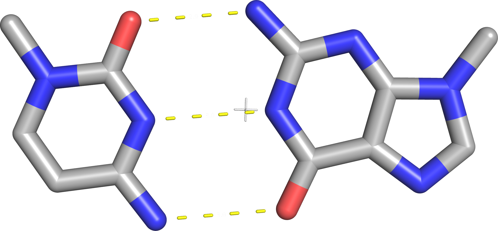

## Standard Basepair Parameters {#sec:std-base-parameters}

There is a set of standard basepair parameters primarily defined for helices of canonical basepairs.
The parameters can be calculated using the software tools DSSR or Curves+, more details in @sec:software-DSSR.
Usually, the basepair parameters presented using the following figure:

](../img/wiki-basepair-parameters.png)

The exact definition of these parameters is still ambiguous, despite efforts to standardize the definitions <https://doi.org/10.1006/jmbi.1998.2390>.
Specifically in <https://doi.org/10.1006/jmbi.1998.2390>, Lu and Olson claim right in the abstract: "The choice of mathematics has only a limited effect on the computed parameters, even in highly deformed duplexes. The results are much more sensitive to the choice of reference frame".
The rest of the publication backs the premise, and we agree that it is the case for canonical basepairs (and all pure Watson-Crick edge pairs).
<!-- The discrepancies have been resolved for the Watson-Crick / Watson-Crick pairs (<https://doi.org/10.1006/jmbi.1998.2390>, <https://doi.org/10.1006/jmbi.2001.4987>), but  -->

### The Standard Reference Frame

[A standard reference frame was defined as the “Tsukuba convention”](https://doi.org/10.1006/jmbi.2001.4987), few years after the <https://doi.org/10.1006/jmbi.1998.2390> publication.
The reference frame essentially defines a coordinate system for each of the five common nucleotides -- the Tsukuba convention includes a table of coordinates for each heavy atom in each base.
We can fit it onto an observed molecule using the [Kabsch algorithm](https://doi.org/10.1107/S0567739476001873) and then apply translation and rotation to align the reference frame.
The reference frame **X** axis is defined to be parallel with the Watson-Crick edge, **Y** axis run alongside the rest of the base.
Since all bases are planar under ideal conditions, this enables us to have the **Z** nearly equal to **0**.

As the authors state, they clearly optimized the coordinate system for the canonical basepairs.
If we place the idealized purine over a pyrimidine with a flipped **Y** axis, we get an idealized Watson-Crick basepair.
Without the **Y**-flip, all bases overlap in the same region, with the glycosidic bond approximately aligned.

{#fig:reference-frame-GC-pair .img-width50}

This property allows us to easily judge an observed basepair by comparing the position and orientation of their reference frame -- comparing the coordinates of frame origins and the vectors of the X, Y, Z axes.
The DSSR papers <https://doi.org/10.1093/nar/gkg680> and <https://doi.org/10.1038/nprot.2008.104> do not contain details on the parameters calculation, but [the DSSR webpage shows quite detailed description in a blog post](https://x3dna.org/highlights/details-on-the-simple-base-pair-parameters).
As x3dna.org post shows, we get the translational parameters from projecting one origin into the other reference frame coordinate system.
**Shear** is the **X** coordinate, **Stretch** is **Y**, **stagger** is **Z**.
The angular parameters are calculated by comparison of axes, we directly quote the article:

* **Propeller** is the ‘torsion’ angle of `z2` to `z1` with reference to the **Y**-axis, and is calculated using the method detailed in the blog post [How to calculate torsion angle?](http://x3dna.org/highlights/how-to-calculate-torsion-angle).
* Similarly, **buckle** is defined as the ‘torsion’ angle of `z2` to `z1` with reference to the **X**-axis.
* **Opening** is defined as the angle from `y2` to `y1` with reference to the **Z**-axis.

{{{TOMUTO SE TEDY MOC ROZUMET NEDA:}}}
We are always using one reference frame as the coordinate system for the other, which can lead to issues if the coordinate systems have a significant relative rotation.
If we had a highly deformed basepair and the reference frame was rotated by 90° along the **X** axis (**buckle = 90°**), we cannot expect the parameters origin **A** coordinates in system **B** be equal to the coordinates of the origin **B** in the system **A**.
In this extreme case, **X** coordinate of **A** in **B** will be equal to the coordinate **Z** of **B** in **A**, effectively interchanging **stagger** with **stretch**.
However, for reasonable practical cases, this difference should be small.
It could also be easily remedied by averaging the two possible results, or defining that purine is always the base nucleobase.
We do not know exactly how DSSR handles this problem, but Curves+ claims to take the average.

### Non-canonical Basepairs in the Standard Reference Frame

When the standard reference frame is applied to all types of basepairs, the meaning of the basepair parameters is somewhat distorted.
The values can still be useful, but we need to be cautious in their intuitive interpretation.
As an example, @fig:1ehz-A8-A14-dssrexample-reframe-fit shows a nearly perfect trans Hoogsteen/Watson-Crick basepair from the [1ehz](https://www.rcsb.org/structure/1EHZ) structure.
In the figure below, we can see that Watson-Crick edges of the two
nucleotides are at an angle slightly below 90° -- implying that the **opening** should be above 90°.
Indeed, DSSR reports an **opening** of 103°.

Normally, **stretch** of **-1.9 Å** would mean that the bases clash with each other, but we can observe **shear** of value **-4.1 Å**.
This means that the reference frames overlap, but the uracil is on the side of the adenine, avoiding the clash.

Generally, we should expect negative **strech** in pairs involving the Hoogsteen or Sugar edge.
Since these pairs are approximately rotated **90°**, **propeller** and **buckle** have interchanged meaning.

 A8:A14 **tWH U-A** pair with the fitted reference basepair.](../img/1ehz-A8-A14-dssrexample-reframe-fit.svg){#fig:1ehz-A8-A14-dssrexample-reframe-fit}

| Parameter | Value |
|-----|-----|
| #bp | rHoogsteen A-U |
| Shear |	-4.1368 Å |
| Stretch |	-1.9096 Å |
| Stagger |	0.7657 Å |
| Buckle |	4.6154° |
| Propeller |	12.1172° |
| **Opening** |	**-103.0907°** |

<!-- | Shift |	2.7007 Å |
| Slide |	-3.2712 Å |
| Rise |	3.3277 Å |
| Tilt |	2.0082° |
| Roll |	8.6317° |
| Twist |	-64.0947° | -->

Notably, this example demonstrates that the base parameters as calculated by DSSR are not symmetric when pushed to such extremes.
In this instance, the adenine origin is examined relative to the uracil reference frame.
If it was inverted, we would observe a positive **stretch** -- the adenine origin has a positive Y coordinate in the uracil reference frame as shown in @fig:1ehz-A8-A14-dssrexample-translation-measure-comparison.
It could be interesting to observe how does DSSR decide which nucleotide is the primary reference frame in each basepair.

{#fig:1ehz-A8-A14-dssrexample-translation-measure-comparison}

On the other hand, the [Curves+ paper](https://doi.org/10.1093/nar/gkp608) explicitly addresses the issue of symmetry, Lavery et al. write: "To do this as symmetrically as possible, we choose an average frame that is obtained by rotation and translation of the first base reference system but now through the half angle $θ_A/2$, about the same axis vector $U_A$, and with the half translation $λ_A/2$".
This exact approach will cause other issues if applied to non-canonical basepairs -- notably we would see the "average reference frame" being perpendicular to the basepair plane, if one of the pairs is rotated 180° around the Y axis, such as in trans Watson-Crick basepairs.
In this case, **opening** and **buckle** would have interchanged meaning.
