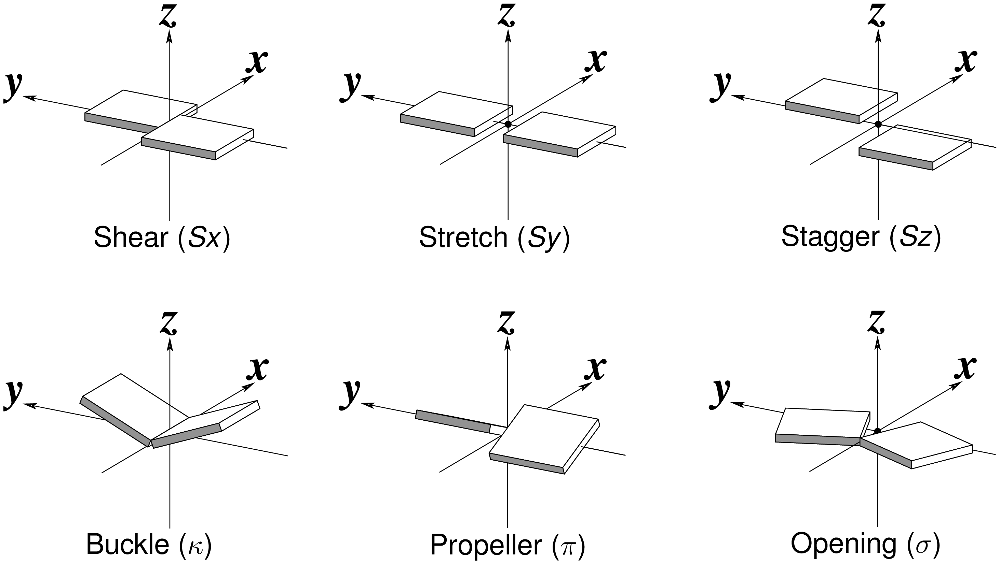
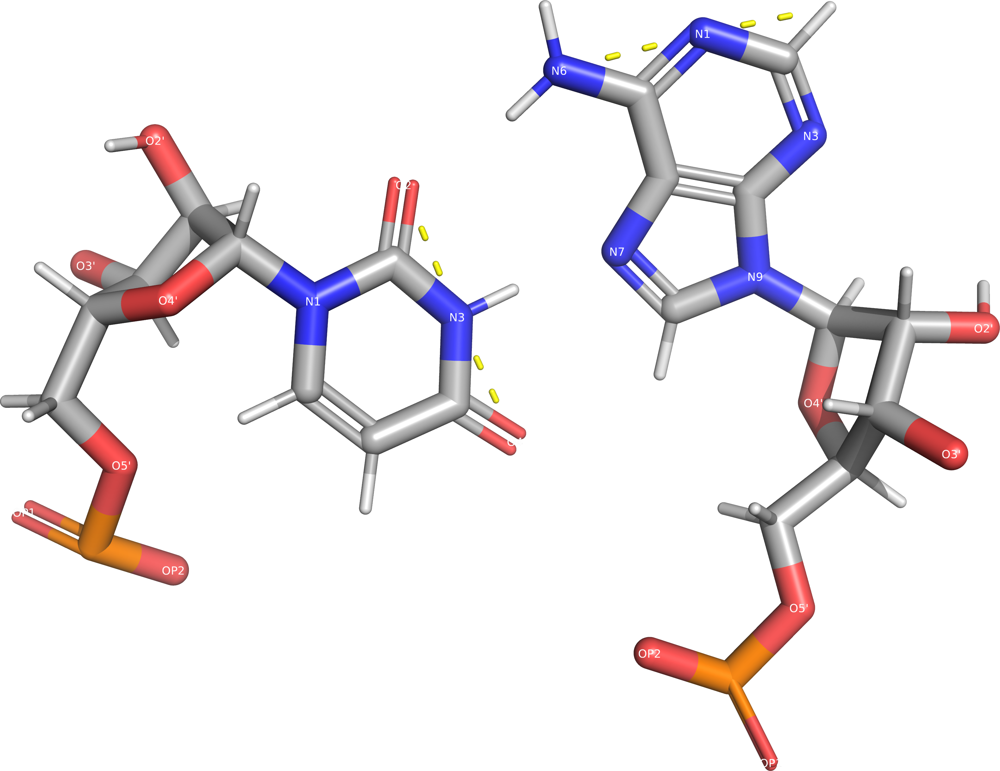

## Standard basepair parameters {#sec:std-base-parameters}

There is a set of standard basepair parameters primarily defined for helices of canonical basepairs.
The parameters can be calculated using the software tools DSSR or Curves+, more details in @sec:software-DSSR.
Usually, the basepair parameters presented using the following figure:

<!--  -->
](../img/wiki-basepair-parameters.png)

However, the exact definition of these parameters is still slightly ambiguous.
The discrepancies have been resolved for the Watson-Crick / Watson-Crick pairs (<https://doi.org/10.1006/jmbi.1998.2390>, <https://doi.org/10.1006/jmbi.2001.4987>), but 

### The standard reference frame

[A standard reference frame was defined at “Tsukuba convention”](https://doi.org/10.1006/jmbi.2001.4987).
The reference frame essentially defines a coordinate system for each of the five common nucleotides -- the Tsukuba convention paper includes a table of coordinates for each base heavy atom.
We can fit it onto an observed molecule and then apply translation and rotation to align the reference frame.
The reference frame **X** axis is defined to be parallel the Watson-Crick edge, **Y** axis run alongside the rest of the base.
Since all bases are planar under ideal conditions, this enables us to have the **Z** nearly equal to **0**.

As the authors state, the clearly optimized the coordinate system for the canonical Watson-Crick basepairs.
If we place a purine with a pyrimidine and flip one along the **Y** axis, we get a canonical basepair.
Without the **Y**-flip, all bases overlap in the same region, with the N1/N9—C1' bond approximately aligned.

This property allows us to easily judge an observed basepair by comparing the position and orientation of their reference frame -- the frame origins and axes to be specific.
The DSSR papers <https://doi.org/10.1093/nar/gkg680> and <https://doi.org/10.1038/nprot.2008.104> do not contain details on the parameters calculation, but [the DSSR webpage shows quite detailed description in a blog post](https://x3dna.org/highlights/details-on-the-simple-base-pair-parameters).
As x3dna.org post shows, we get the translational parameters from projecting one origin into the other reference frame coordinate system.
**Shear** is the **X** coordinate, **Stretch** is **Y**, **stagger** is **Z**.
The angular parameters are calculated by comparison of axes, we directly quote the article:

* **Propeller** is the ‘torsion’ angle of `z2` to `z1` with reference to the **Y**-axis, and is calculated using the method detailed in the blog post [How to calculate torsion angle?](http://x3dna.org/highlights/how-to-calculate-torsion-angle).
* Similarly, **buckle** is defined as the ‘torsion’ angle of `z2` to `z1` with reference to the **X**-axis.
* **Opening** is defined as the angle from `y2` to `y1` with reference to the **Z**-axis.

We are always using one reference frame as the coordinate system for the other, which can lead to issues if the coordinate systems have significant relative rotation.
If we had a very degenerate basepair and the reference frames was rotated 90° along the **X**, we cannot expect parameters origin **A** coordinates in system **B** be equal to coordinates of origin **B** in system **A**.
In this extreme case, **X** coordinate of **A** in **B** will be equal to the coordinate **Z** of **B** in **A**, effectively swapping **stagger** with **stretch**.
However, in reasonable practical cases, this different should be small.
It could also be easily remedied by averaging the two possible results, or defining that purine is always the base base.
We do not know how DSSR handles this problem.

### Non-canonical basepairs

DSSR applies this standard reference frame to all types of basepairs.
This means that the value of some basepair parameters is somewhat distorted, it can still be used, but caution is needed in interpretation.
As an example, we'll show a nearly perfect trans Hoogsteen/Watson-Crick basepair from [1EHZ](https://www.rcsb.org/structure/1EHZ) structure.
In the figure bellow, we can see that Watson-Crick edges of the two nucleotides are at an angle slight bellow 90° -- implying that the **opening** should be above 90°.
Indeed, DSSR reports **opening** of 103°.

Normally, **stretch** of **-1.9 Å** would mean that the bases clash with each other, but we also observe **shear** of **-4.1 Å**.
This means that the reference frames overlap, but uracil is on the side of the adenine.

Generally, we should expect negative **strech** on all pairs involving the Hoogsteen or Sugar edge.
Since these pairs are approximately rotated **90°**, **propeller** and **buckle** have interchanged meaning.

| Parameter | Value |
|-----|-----|
| #bp | rHoogsteen A-U |
| Shear |	-4.1368 Å |
| Stretch |	-1.9096 Å |
| Stagger |	0.7657 Å |
| Buckle |	4.6154° |
| Propeller |	12.1172° |
| **Opening** |	**-103.0907°** |
| Shift |	2.7007 Å |
| Slide |	-3.2712 Å |
| Rise |	3.3277 Å |
| Tilt |	2.0082 TODO |
| Roll |	8.6317 TODO |
| Twist |	-64.0947° |

Notably, this example demonstrates that the base parameters indeed aren't symmetrical when pushed to such extremes.
In this instance, the uracil is being judged relative to the adenine reference frame.
If it was the other way, we'd observe positive **stretch**, the adenine origin is in positive Y coordinates in the uracil reference frame.
It could be interesting to observe how does DSSR decide the orientation on symmetrically defined pairs, such as **cSS G-G**.
