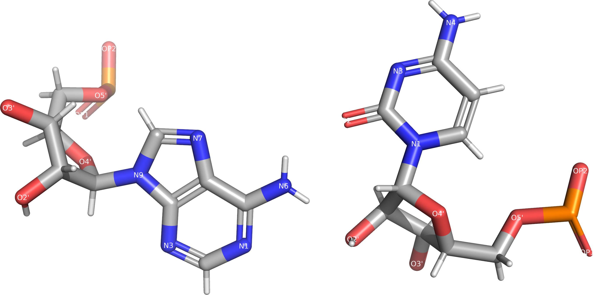

## Software for Base Pair Annotation

A number of software packages exist for determining which nucleotides are pairing within a given PDB or mmCIF structure.
However, due to the absence of universally agreed-upon definitions for all basepair types, different programs usually give slightly different results.
<!-- The differences are mostly constrained to non-typical basepairs and near  -->

In this section, we will list and briefly overview the available tools used for basepair assignment.

### FR3D {#sec:software-FR3D}

We have previously introduced FR3D, which will serve as our primary analysis tool.
FR3D stands for “Find RNA 3D” and is commonly pronounced “Fred”.
[Initially, the software was developed to identify motifs comprised of multiple nucleotides, which we will not cover this in this work.](https://www.bgsu.edu/research/rna/software/fr3d.html)
First version of FR3D was written in Matlab, but it was later rewritten to Python.
We are using the Python version, downloaded from [github.com/BGSU-RNA/fr3d-python](https://github.com/BGSU-RNA/fr3d-python).
It appears that the Matlab version is not as actively maintained anymore.

The primary advantages of FR3D include:

<!-- * It is freely available including the source code. -->
* TODO: convince Craig to actually license it?.
* Ease of use in execution and output processing.
* Ability to annotate almost all basepair families.
* Active maintenance, allowing us to potential influence its algorithms.

Unfortunately, FR3D does not support writing out basepair parameters.

### X3DNA DSSR {#sec:software-DSSR}

X3DNA-DSSR is currently the most commonly used tool for nucleic acid structure analysis.
X3DNA was first [published over twenty years ago](https://doi.org/10.1093/nar/gkg680), with “3DNA” standing for “3D Nucleic-acid Analysis”.
[DSSR, which stands for “Dissecting the Secondary Structure of RNA”](https://doi.org/10.1093/nar/gkv716) is a newer addition to the package specialized for RNA molecules with more complex structure.

DSSR is a commercial product that is not available for free for academic use at the time of writing.
[It requires licensing from the Columbia University at about \$200 for the basic academic license.](https://inventions.techventures.columbia.edu/technologies/dssr-an-integrated--CU20391)
However, an older version, 1.9.9, is free for academic use to ensure reproducibility of the literature relying on DSSR analysis.
The free version was later withdrawn citing the lack of governmental funding as the reason.
On the other hand, the source code of [3DNA was made public in 2016](https://x3dna.org/highlights/3dna-c-source-code-is-available), although users are required to register on the X3DNA forum.

#### Basepair Parameters

DSSR is capable of calculating standard base parameters as discussed in @sec:std-base-parameters.
To obtain the parameter values, DSSR must be executed with the `--analyze` flag, which results in the generation of multiple files containing lists of identified pairs and their calculated parameters.
One of the produced files also includes the translation vector and the orthonormal basis of the standard reference frame for each basepair.

A limitation of DSSR is that it exclusively reports basepair parameters for the pairs identified within the input structure.
In other words, it cannot provide them as complementary information to basepairs identified by alternative methods, such as FR3D.

### RNAView {#sec:software-RNAview}

Similarly to FR3D, [RNAView](https://doi.org/10.1093/nar/gkg529) identifies basepairs the molecular structure and uses the naming Leontis-Westhof system.
First published in 2003, it has received a recent activity in development; notably it has got a support for mmCIF files few months ago.
[The current version is published on GitHub](https://github.com/rcsb/RNAView).

Somewhat uniquely, the [Yang et al. (2002)](https://doi.org/10.1093/nar/gkg529) details the used basepair determination algorithm.
In short, they consider three basic rules:

1. The angle between base planes must be bellow 65°.
2. The vertical distance between the planes (at the point of contact) must be bellow 2.5 Å.
3. Two hydrogen bonds must exist, one of which is allowed to involve a carbon atom.

However, RNAView unfortunately does not perform very well in practice, although we find it inspiring that such simplicity is feasible.
While the algorithm may at first feel to be not strict enough, RNAView in fact has more problems identifying good basepairs than misidentifying bad ones.
For instance, in the tHS AC class, RNAView frequently misidentifies pairs as another family or misses them entirely -- we can see that [on prof. Zirbel's annotation comparison](http://rna.bgsu.edu/experiments/annotations/compare_v7_tHS_A,C_3.0A.html).

TODO kde jsou ty naše porovnání??

{#fig:rnaView-tHS-AC-misidentified}

### Curves+ {#sec:software-Curves}

Curves is the second software tool which can calculate the TODO

<https://doi.org/10.1093/nar/gkp608>
