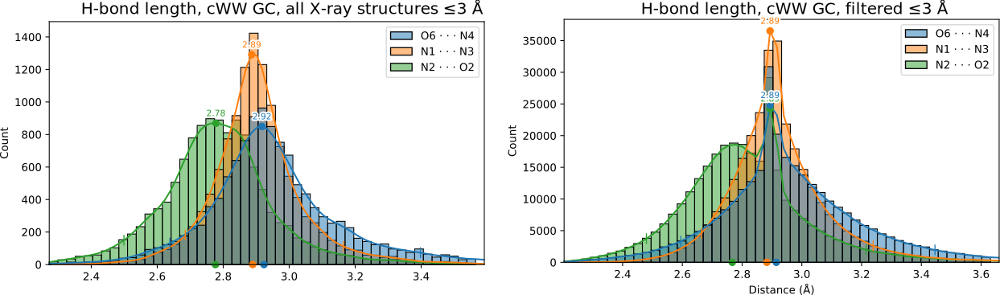

## Data selection

In order to get useful statistics, we need a large enough data sample.
However, we also have to make sure that the data has a high enough quality, most importantly try to remove any biases.
It is not such a problem if the data is noisy, as the statistics can deal with variance provided enough observations.

Even if we do not have thousands of datapoints, we can characterize the uncertainty arising from the noise using confidence intervals.
However, we will get overconfident intervals, unless the observations are independent of each other.

Since multiple entries in the PDB often share a common refined with only a varying ligand, we have to remove redundant structures to avoid bias.
We will also filter out nucleotides which do not satisfy MolProbity and DNATCO criteria.
Nucleotides with a bad RSCC (electron density fit) are also removed.

The filtration methodology was prepared by Jiří Černý laboratory, and we only utilized their prepared lists of passing nucleotides.
Given the filter is rather selective, we accepted all basepairs with at least of the two nucleotides passing the filter.

TODO jirkův filtr popis:

<!-- 

The preparation of a curated reference subset of PDB data involved three steps:
    1. Defining a sequentially non-redundant subset of crystal structures containing nucleic acids;
    2. Finding the highest quality chain in each cluster of homologous sequences;
    3. Applying per-residue quality score cutoffs to the highest quality chains.

To create a sequentially non-redundant subset of structures (Step 1), a list of X-ray PDB entries containing nucleic acids with available reflection data was collected using an NAKB query, returning 8,783 PDB IDs (as of 16 Oct 2022). The sequence information for each chain was obtained from the RCSB PDB using a graphQL query for each ID. All nucleic acid sequences were aligned using the pairwise2.align.localds function of BioPython, employing an extended nucleic acid  substitution matrix. The NAKB query, graphQL query, and alignment code are available in the Supplementary Materials. Only purely DNA or RNA chains were analyzed. The aligned sequences were clustered separately for DNA and RNA based on their sequence dissimilarity. Sequences were considered redundant if they have fewer than three mutations (including gaps/termini) for sequences up to 24 residues, or less than 10% mutations for longer chains. Identical sequences of nucleic acids from NA:protein complexes and from “naked” structures were treated as non-redundant.

The highest quality chain in each cluster of homologous sequences was then identified using a score assigned to each chain (Step 2). The score extended the “BGSU RNA score” (Roll et al., 2016) for a consistent description of DNA and RNA, using validation data downloaded from the RCSB PDB in XML format. The quality score was a weighted combination of resolution (weight 1), Rfree (x 18), clashscore (x 0.05), average per-residue value of 1.000-RSCC (x 8), average per-residue RSR (x 8), and fraction of unobserved residues (x 4). Weights were optimized so that each quality indicator contributed roughly equally to the standard deviation of the composite quality score. The subset of highest quality non-redundant chains belonging to crystal structures with better than 1.8 Å resolution (539 DNA and 206 RNA chains) contained a sufficient number of residues (6,644 DNA and 4,236 RNA) for further analysis; the results supporting this reference set size will be discussed in Section 3.2.

Experience with the development of a similar high-quality reference set for proteins showed that chains of good overall quality almost always contain some extremely poor regions (Williams et al., 2022). Therefore, we decided to implement a residue-level filter to exclude severe errors (Step 3). For this reference set, the most important consideration was to remove cases where a residue is modeled in an incorrect local minimum conformation, resulting in a strain that distorts the covalent geometry. The final reference set was the intersection of the residues that passed the two independent filtering systems described below, one using MolProbity criteria, and one using DNATCO criteria. 

The first filtering system utilized the DNATCO web server (Černý et al., 2020) for the assignment of sugar-phosphate backbone conformation (NtC) to each dinucleotide step (neighboring pair of residues) within a chain. This system is based on the expectation that if all backbone torsion angles, sugar puckers, and the overall shape of a dinucleotide step are close to a known conformational class, the deviations in the covalent geometry of its residues are not too large. Dinucleotide steps assigned to one of the known NtC classes had to fulfil the following criteria: the step confal score should be ≥ 60 (where 100 is the perfect score), backbone atoms harmonic mean real-space correlation coefficient (RSCC) ≥ 0.8, and backbone atoms RMSD ≤ 0.5 Å. Further, if the previous step in the chain was not assigned to a known NtC conformation class, meaning that the more distant 5’-part of the residue in the dinucleotide was less reliable, we used only backbone atoms from C5’ to O3’ in such a residue, otherwise, the residue atoms including the phosphate group were used. This filtering procedure returned 4,336 DNA and 3,082 RNA residues.

The second residue-level filtering system used MolProbity (Williams et al., 2018) and comprised two main components: model-to-map fit and model validation metrics. For model-to-map fit, chains were assessed with phenix.real_space_correlation detail=atom, using .mtz reflection data files provided by the PDB. For a residue to be included in the reference set, all of its member non-H atoms were required to have real-space correlation coefficient (RSCC) ≥ 0.7 and 2mFo-DFc map value ≥ 1.2σ at the atom site. Additionally, the backbone P atom, which carries about twice as many electrons as N/C/O atoms, was required to have 2mFo-DFc map value ≥ 2.4σ.  The B-factor was not used as a filtering criterion, as its treatment was found to be too inconsistent across resolutions and refinement programs. Moreover, for a residue to be included, it was required to have no steric clashes ≥ 0.5 Å (Word et al., 1999). For RNA, residues with sugar pucker outliers (Jain et al., 2015) were also removed. Notably, because this reference was prepared for assessing covalent bond geometry, bond length and bond angle outliers were not used as explicit criteria for filtering. Additionally, non-standard bases and residues with alternate conformations were removed from the reference set, as finding the correct traces through alternate positions is known to be prone to errors (Richardson et al., 2023).

The combined residue-level filtering resulted in 3,202 DNA residues and 2,544 RNA residues modeled with high confidence; the reference set is available in the Supplementary Materials. -->
