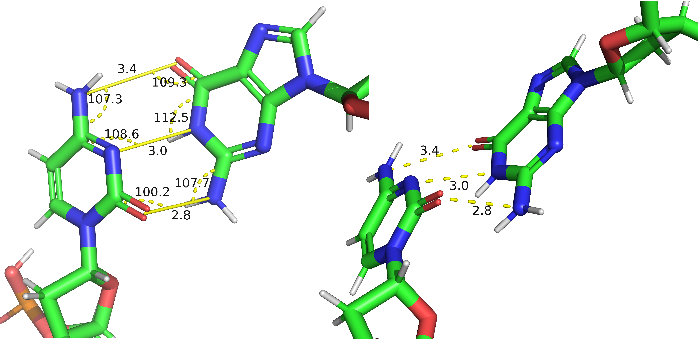

## New Basepair Parameters {#sec:basepair-params}

The objective of this work is to find and compare robust measures of basepairing.
It is essential that humans can understand why the computer did or did not assign a particular basepair, either for debugging the software or refining molecular structures.
Thus, we want the parameters to be reasonably simple and interpretable.

Parameters suitable for basepair assignment should have the following
main qualities:

* **Interpretability** — Can we easily tell what the parameter means in a geometrical sense? Can we estimate the parameter value by looking at the 3D structure?
* **Simplicity** — The parameter is easy to define and calculate algorithmically.
* **Stability** — The parameter should have low variance for good quality basepairs.
* **Universality** — The parameter should have similar value or similar variance in different basepair classes.
<!-- * **Independence** — Optimally, the parameter, if the distribution is uncorrelated with the other parameters we want to use. -->

<!-- We need to define basepairs in such a way, that humans can easily understand the results of computer calculations. -->

In order to be useful, each parameter must have a sharp enough distribution to help with identifying specific basepair classes.
In @fig:cWH-G-G-yaw-hbond, we show that the **yaw** angle (see @sec:basepair-params-ypr) performs relatively well on the **cWH G-G** class, while the H-bond length has a comparatively long tail.
Extending an allowed range of the H-bond length would still find new FR3D pairs, but would also quickly amass false positives
For similar reasons, we entirely ruled out using ZXZ Euler angles in @sec:basepair-params-ypr because their values span indiscriminately the entire range of $[-180°, +180°)$.

{#fig:cWH-G-G-yaw-hbond}

### The number of parameters

If we assume that the molecules have an ideal valence geometry the relative position of two bases is completely determined by six numbers.
The standard basepair parameters (@sec:std-base-parameters) can be one such description — essentially, we only need three translation coordinates and three angles of relative rotation.
However, we are not able to characterize all the basepair types using simple numeric ranges of this minimal set of parameters.

Additionally, we consider it more elegant to avoid “hard cuts” in the data distributions.
In the words of Craig Zirbel, the author of the FR3D program: "we would prefer to allow broad ranges on many parameters, rather than a smaller number of uncompromising cutoffs".
FR3D indeed performs very well regarding this — we did not find many unnatural-looking lines in any of our scatter plots and histograms when plotting our new parameter values for FR3D-determined basepairs.
Since each of the limits cuts out a small fraction of the potential basepairs, the exact value of the limits is not as sensitive.
That makes it easier to set the limit and also allows us to share the same conditions across all classes of a given basepairing family.

Generalizing the constraints into two or more dimensions is similar to inventing additional parameters by linearly combining the existing ones, except that the potential new parameter is easier to share across the ~120 basepair classes.
Therefore, we avoid more complex constraints than one dimensional numeric ranges.

### Hydrogen bond lengths and angles {#sec:basepair-params-hbonds}

A physically meaningful starting set of parameters are distances between atoms forming hydrogen bonds or other contacts between atoms of the paired bases defining basepairs in the Leontis-Westhof classification.
We will call all of these contacts "hydrogen bonds" or "H-bonds". 
Ideally, we would measure a hydrogen bond between the hydrogen and the
acceptor heavy atom.
Since the exact hydrogen positions are rarely known, we will instead only consider distances between heavy atoms (oxygen, nitrogen, or carbon).
Despite the availability of algorithms for adding the hydrogen atoms to PDB structures, there are cases where the automatic completion fails.
This happens for instance in cases when a base holds charge and thus has an additional hydrogen, such as those [in i-Motif cytosine pairs](https://doi.org/10.1002/anie.202309327).
Alternatively, the base may be in an unusual tautomeric form where its hydrogens are on different atoms than usual.
Although it is not very common, it is crucial in some basepair classes, and it is biologically relevant in a number of cases.
We have already discussed the anionic form of **cWW G-U** (@sec:bp-terminology-lw-edgecase-a, <https://doi.org/10.1261/rna.079583.123>), but we can also [find a protonated **cWW C-U** in the ribosomes of some species](https://doi.org/10.1093/nar/29.24.5067) and even a [charged _"canonical"_ **cWW G-C** pair may exist](https://doi.org/10.1002/cphc.200900687).

<!-- maybe cWH-A-G ?? -->

In addition to distance measurements, we need to use other parameters defining the geometry of hydrogen bonds.
We use two angles between the two heavy atoms forming the H-bond and a third neighboring atom situated on each base.
Depending on whether we select the third atom next to the acceptor or donor, we call the parameter "Acceptor angle" or "Donor angle".
For consistency, we will always select the last neighbor when ordered lexicographically by PDB atom name as the third atom.

<!-- fetch 3Lz0
select pair, 3Lz0 and (chain J and resi 21 or chain I and resi \-20) -->

The H-bond distances and angles do not suffice to assign a pair. 
Even if we set strict limits on these parameters, we get many false positives.
As shown [in figure @fig:cWW-GC-length-and-covalent-angles], an ideal **cWW G-C** pair should have H-bond lengths of about 2.9 Å and all angles at about 120°.
We must allow some deviations, as in reality, no ideal pair exists, and 0.5 Å and 20° tolerance is very conservative.
Yet, we still find false positives like the one shown in @fig:cWW-GC-false-positive-hbond-lengthsangles.
Tightening the limits slightly would dismiss this example, but we are hitting the other limit of this simple approach as we are already losing many good pairs, as we can see using the
[basepairs.datmos.org](https://basepairs.datmos.org/#cWW-G-C/hb0_L=..3.4&hb0_DA=100..140&hb0_AA=100..140&hb1_L=..3.4&hb1_DA=100..140&hb1_AA=100..140&hb2_L=..3.4&hb2_DA=100..140&hb2_AA=100..140&baseline_ds=fr3d-f) web application.

{#fig:cWW-GC-length-and-covalent-angles}

{#fig:cWW-GC-false-positive-hbond-lengthsangles}

<!-- fetch 3Lz0
select pair, 3Lz0 and (chain J and resi 21 or chain I and resi \-20) -->

### Coplanarity of bases forming a pair

After hydrogen bonds, the second most important feature of pairing bases is their coplanarity.
Coplanarity is not easily defined by a single parameter. 
The first of our proposed parameters measuring coplanarity is the deviation of hydrogen bonds from the base planes.
Indeed, false "basepair" from @fig:cWW-GC-false-positive-hbond-lengthsangles has H-bonds almost perpendicular to both base planes.

First, we must determine the base planes.
All natural nucleic acid bases are close-to-planar aromatic rings but they might be slightly deformed.
Therefore, we find the best fitting plane according to the least squared distance.
Each hydrogen bond forms a line segment between the two heavy atoms, which we project onto the plane and calculate the angle between the projection and the original line segment.

As each base plane is different, we get two separate numbers, in analogy to the donor and acceptor angles.
We could name these parameters "Donor Plane Angle" and "Acceptor Plane Angle", but the conceptual relation to the hydrogens is less important than the relation with the particular base planes.
We will therefore name the parameters **"Left Plane Angle"** and **"Right Plane Angle"**, assuming the first base is placed on the left, as in left-to-right text.

{#fig:metrics-hbond2plane-4v9i-1-AA_479-AA_453}

### Plane to plane comparison

We have a number of other options for comparing the relative orientation of the base planes.
The obvious choice is the angle between the planes, more specifically the angle between their normal vectors as used for example in <https://doi.org/10.1261/rna.381407>.
We will simply call this number the **Coplanarity angle**.
That does not capture the vertical distance and also cannot distinguish "bent" from "twisted" basepairs.
In the language of the standard basepair parameters (@sec:std-base-parameters), using these parameters we cannot differentiate large propeller from large buckle.

To discriminate between these two types of base-base nonplanarities, we define two new parameters utilizing information about the pairing edge.
For each basepair class, we know which atoms form the hydrogen bonds and we also know which atoms form the Watson-Crick/Hoogsteen/Sugar edges in the Leontis-Westhof nomenclature.
The **Edge to plane distance** is the minimal distance of atoms of the first base pairing edge to the plane of the second base.
The **Edge to plane angle** is the angle between the line of first residue pairing edge and the plane of the second residue.
Each edge has at least two atoms in RNA, allowing us to calculate the angle even if only one hydrogen bond defines the L-W class. 
Both of these parameters depend on the order of bases --
the two **Edge to plane angles** are usually very similar, but **Edge to plane distances** can be very different when the basepair is "bent".
<!-- A symmetric alternative would be to take center point of both edges, project it onto both planes the distance between the center -->

<!--
fetch 4v9i
select pair, 4v9i and chain AA and resi 479+453
show sticks, %pair
orient %pair
hide everything, not %pair-->

{#fig:metrics-edge2plane-angle-4v9i-1-AA_479-AA_453}

<!--
fetch 4dv6
select pair, 4dv6 and chain A and resi 1200+1055
show sticks, %pair
orient %pair
hide everything, not %pair-->

{#fig:metrics-edge2plane-distance-4dv6-1-A_1200-A_1055}

The above-defined parameters work well on most basepair classes.
As described in @sec:testing-basepair-params, we can verify that
by calculating the parameters for all close contacts found in PDB and bounding them by the maximum range observed in basepairs reported by FR3D.
When we do that with the five H-bond parameters and the five coplanarity measures, we are able to reproduce the FR3D reported set with sufficient fidelity on most classes. 
For instance, in the **cWW U-U** class, we have about 60 _false positives_ out of 750 total basepairs, most of which look "close enough".

<!-- Out of which, we claim that the vast majority of false positives are valid basepairs of this category, albeit slightly stretched or shifted.
We would like to encourage the readers to [judge for themselves in the basepairs.datmos.org web application.](https://basepairs.datmos.org/#cWw-U-U/hb0_L=..4&hb0_DA=85..145&hb0_AA=95..155&hb0_OOPA1=-45..35&hb0_OOPA2=-45..60&hb1_L=..4.1&hb1_DA=85..140&hb1_AA=90..155&hb1_OOPA1=-40..35&hb1_OOPA2=-50..35&min_bond_length=..3.8&coplanarity_a=135..&coplanarity_edge_angle1=-30..45&coplanarity_edge_angle2=-35..45&coplanarity_shift1=-1.6..1.7&coplanarity_shift2=-1.1..1.5&baseline_ds=fr3d-f) -->

### Relative base rotation {#sec:basepair-params-ypr}

The remaining weak point of our parameter set is the assignment of basepair classes defined by only a single hydrogen bond.
Such a basepair is free to rotate by 180 degrees around the H-bonded atoms, remaining planar, but at the same time changing the Leontis-Westhof class. 
An example of this issue is shown in figure @fig:metrics-ypr-necessity-tHH-GG-misassignment, and the [web application demonstrates this issue interactively](https://basepairs.datmos.org/#tHH-A-G/hb0_L=..4&hb0_DA=100..150&hb0_AA=100..165&hb0_OOPA1=-25..35&hb0_OOPA2=-10..35&min_bond_length=..3.8&coplanarity_a=..40&coplanarity_edge_angle1=-10..25&coplanarity_edge_angle2=-10..30&coplanarity_shift1=-0.2..1.5&coplanarity_shift2=-0.3..1.3&baseline_ds=fr3d-f).

{#fig:metrics-ypr-necessity-tHH-GG-misassignment}

Utilizing the [euler angles](https://en.wikipedia.org/wiki/Euler_angles), we can describe the relative rotation of two planes by three angular parameters.

Their definition requires the definition of coordinate systems for both bases in a potential pair.
Although the choice of coordinate system significantly affects the calculated angles, it has little impact on the variance and the exact values are irrelevant for our use case.
The choice of the coordinate system is thus essentially arbitrary, and we choose a simple option.

<!-- {????? The relative position of the pairing bases can be trivially described as the translation vector of the two coordinate systems, but this is already covered reasonably well by the hydrogen-bond parameters.} -->

We place the origin in the N1 or N9 atom, and align the glycosidic bond with the negative Y axis, as illustrated in [figure @fig:MMB_reference_frame-purinepluspyrimidine].
The C6 pyrimidine or C8 purine atom is placed in negative X direction with zero Z coordinate, uniquely determining the new coordinate system.
The coordinate system is similar to that used in [MMB (formerly RNABuilder)](https://doi.org/10.1109/TCBB.2010.104), except that the X and Y axis are swapped and negated.
These modifications were proposed by Craig Zirbel to roughly align the coordinate system with the one used in FR3D, as it conveniently places the Watson-Crick edge in positive X and Y coordinates.

We will calculate the **ZYX intrinsic Euler angles**
between the coordinate systems defined by each base.
It offers a good interpretability as [so-called "aircraft angles" **Yaw**, **Pitch**, and **Roll**](https://en.wikipedia.org/wiki/Aircraft_principal_axes).
If we imagine an aircraft flying over the first glycosidic bond with its wings aligned along the base plane, the three angles describe the necessary maneuvers to align itself with the glycosidic bond of the second nucleotide.
We can also easily demonstrate these angles by issuing three subsequent `turn` commands in PyMOL.

<!-- decribing the plane orientation relative to the Earth surface.
In our case, "the aircraft", i.e. the base, is pointing from the glycosidic bond of the first base to the second base, with the "wings" aligned along the plane of the first base. -->

{#fig:MMB_reference_frame-purinepluspyrimidine}

<!-- TODO {UKAZAL BYCH TO NEJDRIV NA DVOU LETADLECH:} -->

{#fig:metrics-yaw-pitch-roll-3dil_A68_126_cWH-G-A}

### Summary of new base parameters

For clarity, this is the list of all parameters we defined above:

* **"H-bond length"** -- The distance between heavy atoms of each H-bond.
* **"H-bond acceptor/donor angle"** -- The angle H-bond acceptor, donor a third atom on each base.
* **"H-bond to plane angle"** -- The angles between the H-bond and each base plane.
* **"Coplanarity angle"** -- The angle between base planes.
* **"Edge to plane angle"** -- The angles between each base plane and the other base interacting edge.
* **"Edge to plane distance"** -- The shortest distances between each base plane and an atom of the other base interacting edge.
* **"Yaw, Pitch, Roll angles"** -- The 3D rotation between the bases, rooted in the glycosidic bond.
