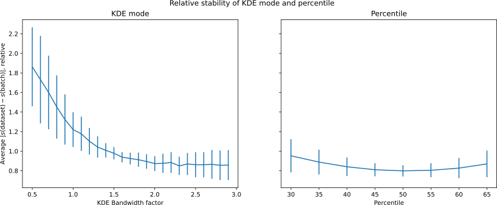

## Optimal Parameter Values

<!-- We totally understand that even if two basepairs are in the same category, they shouldn't be necessarily equal.
In the same conditions, maybe yes, there should be an optimal geometry with minimal energy.
But biological structures are interesting because they aren't the same, and thus the basepairs are not in the same conditions.
Actually, one of the main goals of this project is to show that a basepair type is a distribution, not just a single idealized example as was shown in LSW2002.
We wouldn't find many interactions in real data, if we insisted on the optimal conformation.
Most of the measured data is however noise, remember we dealing with 3Å resolution.
So it is useful to extract the mean value from it, if only to then find out how far does a given example deviate from it. -->

Given the inherent variability of biological structures, we have to recognize that a basepair category cannot be reduced into a single optimal value for each measured parameter.
Under identical conditions, a single geometry with minimal energy most likely exists, but basepairs in biological structures are seldom in the same conditions.
This project aims to demonstrate that a basepair type is better represented as a distribution, rather than a singular idealized example.
By insisting on the optimal conformation, we risk either observing the nucleic acid interactions infrequently, or classifying most PDB structures as erroneous.

However, we also have to acknowledge that the measured parameters are inherently noisy, especially considering the ~3 Å resolution of large parts of our dataset.
Therefore, extracting the mean value from the data is useful, if only to determine the degree of deviation of a specific example.

<!-- Even though basepairs are in the same category, 
Our goal is to show that each of the measured parameters has a distribution -->

<!-- We will not bother ourselves with the canonical Watson-Crick A-U and G-C pairs too much, since they are well studied already. But this is great for calibrating our measurements to the well-known optimal canonical basepair parameters. -->
In this work, we will generally not focus on canonical Watson-Crick A-U and G-C base pairs, given that these pairs are already extensively studied.
However, they will serve as valuable references in calibrating our measurements to the well known optimal canonical basepair parameters.
We'll use the [hydrogen-bond lengths provided as restraints for building nucleic acid structures in](https://doi.org/10.1107/S2059798321007610) as the reference values for the comparison.

### Choice of a Summary Statistic

There are several options available for calculating the middle value of a distribution.
Obvious choices are the arithmetic mean and median (the 50th percentile).
However, any other percentile, such as the 45th percentile, could potentially offer better properties for our specific use case.
Calculating the mean of a measured hydrogen bond length will likely be sensitive to outliers at the high end.
To mitigate this issue, we could calculate a trimmed mean, choosing to filter out X percentiles from each end before the calculation.

#### KDE Mode

A more sophisticated option involves using [Kernel Density Estimate (KDE)](https://en.wikipedia.org/wiki/Kernel_density_estimation) of the distribution and measuring its mode, i.e., finding the maximum of the KDE function.
The density estimate requires a bandwidth parameter which has a large impact on the resulting distribution.
The bandwidth is conceptually similar to a bin width in a histogram;the KDE can be thought of as a histogram constructed from Gaussian curves instead of rectangles.

Several automatic bandwidth determination methods exist, and we'll use the Scott's formula recommended in `scipy` documentation [TODO cite].
The formula depends on the number of samples and on the variance of the provided datapoints.
Optionally, we can specify an adjustment factor of the computed value -- for instance, making the bandwidth 1.5-times larger than the Scott's formula result.

<!--
Since we might want to compare several programs and experiment with changing the threshold, the resilience to outliers of the KDE mode is very useful.
It is also advantageous that it will select the highest peak in case of multi-modal distribution.
However, we have to verify that it is sufficiently stable and accurate on smaller samples.
It is also not great that it is computationally significantly more intensive, the implementation using `scipy` a has quadratic algorithmic complex.
Plus we cannot get a confidence interval by simply considering the standard deviation like to mean, we'll have to do bootstrap. -->

The KDE mode's resilience to outliers and multi-modal distributions make it useful for comparing different methods and manipulating their thresholds.
However, since this usage is slightly uncommon, it is crucial to verify its stability and accuracy when dealing with smaller sample sizes.
It is also worth noting that using the KDE has a significantly higher computational cost than a simple mean or median, a naive implementation of the mode calcultion will have a quadratic algorithmic complexity.
Furthermore, the determination of a confidence interval requires some form of resampling, instead of the simpler application of central limit theorem.

#### Comparing the Methods

We can conduct a simple experiment to choose a summary statistic which performs well.
The evaluation criteria will be:

1. **Accuracy**: We will assess the proximity to the reference H-bond lengths.
2. **Stability on smaller samples**: We will compare the variance of the statistic itself across samples.
3. **Stability on skewed samples**: We will cut out part of the dataset based on one parameter and observe how much do other parameters change. TODO

First, we will measure the mean absolute difference between the statistics derived on small samples with the reference hydrogen bond lengths of canonical basepairs.
We'll use sample size of 100 for the test, given that about a hundred is a typical number of instances of a non-canonical basepair.
Although many classes have much fewer found instances, we don't want to optimize the method for cases where we won't be able to produce a reliable number anyway.
We have slightly over 30 000 datapoints in the canonical classes, so 1000 sampled batches should provide an ample coverage the available dataset.

The following figure -@fig:KDE_bandwidth_golden_length_deviation compares various bandwidth adjustments of the default Scott's factor.
It is clear that the general optimum is in the range from 1.0 to 1.5, although we can see that different hydrogen bonds would have different optima.

 / KDE mode with bandwidth adjustment 0.5 … 3.0](../img/KDE_bandwidth_golden_length_deviation.svg){#fig:KDE_bandwidth_golden_length_deviation}

In @fig:percentile_golden_length_deviation, we can see that percentiles are almost as accurate as the KDE mode.
Interestingly, the 46th percentile is the closest to the reference values on average.
However, as shown in the right plot, the optimal percentile varies widely across the different hydrogen bonds.
This indicates that observations do not exactly correspond with the reference values -- for instance, measurements of **GC N2 · · · O2** are generally shorter than the reference, making the 60th percentile the closest fit.
The variability of the optimal KDE bandwidth can be explained similarly, with the caveat that the bias direction less straightforward.

 / percentile 30 … 70](../img/percentile_golden_length_deviation.svg){#fig:percentile_golden_length_deviation}

The second criterion is the stability on small samples.
We will measure the statistic across the entire dataset and compare its mean absolute deviation with that of 1000 randomly sampled subsets of size 100.
In this case, it isn't necessary use the H-bond lengths exclusively, we can use all other parameters we are currently working with (see the following sections).

Since not all parameters are in the same range, we cannot average the errors from all parameters.
Instead, we will first divide each deviation by the average deviation for a specific parameter.
Given a $n \times m$ matrix $D$ containing deviations for each parameter and each statistic, we can calculate the matrix $R$ of relative deviations:

$$R_{ps} = \frac{D_{ps}}{n^{-1} \cdot \sum_{k=1}^{n} D_{ks}}$$

This formula calculates the relative deviation $R_{ps}$ of a specific data point $p$ with respect to the statistic $s$.
The overall performance of a statistic is then calculated as a mean of a column $s$ in matrix $R$.
As shown in figure -@fig:percentile_kdemode_stability_GC_AU, the percentiles are significantly more stable when compared to the KDE mode.

TODO compare effect size with ^

{#fig:percentile_kdemode_stability_GC_AU}

TODO: The 3., biased distributions

#### Conclusions

The median will serve as the primary point of reference in the analysis.
However, if the KDE mode deviates noticeably from the median, it may signify a more intricate distribution, necessitating further exploration.
It may be a bimodal distribution or one with a long tail on one side.
The KDE will have a bandwidth factor of 1.5 (TODO actually do so).
Both median and the KDE mode will thus be included in our output tables.
