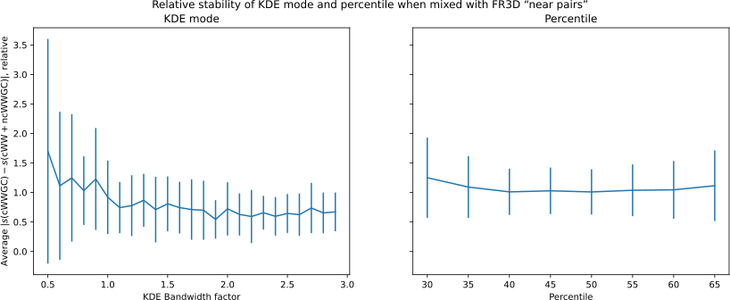

## Optimal Parameter Values {#sec:opt-params}


Given the inherent variability of biological structures, we have to recognize that a basepair class cannot be reduced into a single optimal value for each measured parameter.
Under identical conditions, a single geometry with minimal energy most likely exists, but basepairs in biological structures are seldom found in exactly the same conditions.
This project aims to demonstrate that a basepair class is better represented by a distribution, rather than an idealized example.
By insisting on the optimal conformation, we risk either observing the nucleic acid interactions infrequently, or classifying most PDB structures as erroneous.

However, we also have to acknowledge that the measured parameters are inherently noisy, especially considering the approximately 3 Å resolution of large parts of our dataset.
Therefore, extracting the mean value from the data is useful, if only to determine the degree of deviation of a specific example.

In this work, we will generally not focus on canonical Watson-Crick A-U and G-C basepairs, given that these pairs have been extensively studied.
However, they will serve as valuable references in calibrating our measurements to the well-known optimal canonical basepair parameters.
We will use the [hydrogen-bond lengths provided as restraints for building nucleic acid structures](https://doi.org/10.1107/S2059798321007610) as the reference values for the comparison.

### Choice of a Summary Statistic

There are several options available for calculating the _middle value_ of a distribution.
Obvious choices are the arithmetic mean and the median (the 50th percentile).
However, any other percentile, such as the 45th percentile, could potentially offer better properties for our specific use case.
Calculating the mean of a measured hydrogen bond length will likely be sensitive to outliers at the high end.
To mitigate this issue, we could calculate a trimmed mean, choosing to filter out $X$ percentiles from each end before the calculation.

#### KDE Mode

A more sophisticated option involves using [the Kernel Density Estimate (KDE)](https://en.wikipedia.org/wiki/Kernel_density_estimation) of the distribution and measuring its mode, i.e., finding the maximum of the KDE function.
The density estimate requires a bandwidth parameter which has a large impact on the resulting distribution.
The bandwidth is conceptually similar to a bin width in a histogram; the KDE can be thought of as a histogram constructed from Gaussian curves instead of rectangles.

Several automatic bandwidth determination methods exist, and we will use the Scott's formula [recommended in `scipy` documentation](https://docs.scipy.org/doc/scipy/reference/generated/scipy.stats.gaussian_kde.html), which depends on the number of samples and on the variance of the provided datapoints.
Optionally, we can specify an adjustment factor of the computed value -- for instance, making the bandwidth 1.5-times larger than the Scott's formula result.

<!--
Since we might want to compare several programs and experiment with changing the threshold, the resilience to outliers of the KDE mode is very useful.
It is also advantageous that it will select the highest peak in case of multi-modal distribution.
However, we have to verify that it is sufficiently stable and accurate on smaller samples.
It is also not great that it is computationally significantly more intensive, the implementation using `scipy` a has quadratic algorithmic complex.
Plus we cannot get a confidence interval by simply considering the standard deviation like to mean, we will have to do bootstrap. -->

The KDE mode's resilience to outliers and multi-modal distributions make it useful for comparing different methods and manipulating their thresholds.
However, since this usage is slightly uncommon, it is crucial to verify its stability and accuracy when dealing with smaller sample sizes.
It is also worth noting that using KDE has a significantly higher computational cost than a simple mean or median, a naive implementation of the mode calculation has a quadratic algorithmic complexity.
Furthermore, the determination of a confidence interval requires some form of resampling, instead of the simpler application of central limit theorem.

#### Comparing the Methods

We can conduct a simple experiment to choose a _middle value_ statistic which performs well.
The evaluation criteria will be:

1. **Accuracy**: We will assess the proximity to the reference H-bond lengths.
2. **Stability on smaller samples**: We will compare the variance of the statistic itself across multiple smaller samples.
3. **Stability on skewed samples**: We will observe the deviation of the statistic when the basepair assignment criteria change.

First, we will measure the **accuracy** as the mean absolute difference between the statistics derived on small samples with respect to the reference hydrogen bond lengths of canonical basepairs.
We will use sample size of 100 for the test, given that it is a typical number of instances of a non-canonical basepair.
We have slightly over 50 000 datapoints in the canonical classes, so 1000 sampled batches should provide an ample coverage the available dataset.

The figure [-@fig:KDE_bandwidth_golden_length_deviation] compares various bandwidth adjustments of the default Scott's factor.
It is clear that the general optimum is in the range from 1.0 to 1.5, although we can see that different hydrogen bonds length have slightly different optimal bandwidths.

 / KDE mode with bandwidth adjustment from 0.5 to 3.0](../img/KDE_bandwidth_golden_length_deviation.svg){#fig:KDE_bandwidth_golden_length_deviation}

In @fig:percentile_golden_length_deviation, we can see that percentiles are almost as accurate as the KDE mode.
Interestingly, the 46th percentile is the closest to the reference values on average.
However, as shown in the right plot, the optimal percentiles vary widely across the different hydrogen bonds.
This indicates that observations do not exactly correspond with the reference values -- for instance, measurements of **GC N2 · · · O2** are generally shorter than the reference, making the 60th percentile the closest fit.
The variability of the optimal KDE bandwidth can be explained similarly, with the caveat that the bias direction is less straightforward.

 / percentile 30 … 70](../img/percentile_golden_length_deviation.svg){#fig:percentile_golden_length_deviation}

The second criterion is the **stability on small samples**.
We will measure the statistic across the entire dataset and compare its mean absolute deviation with that of 1000 randomly sampled subsets of size 100.
In this case, it isn't necessary use only the H-bond lengths, we can use all other parameters we are currently working with (@sec:basepair-params).

Since the parameters aren't in the same range, we will normalize the deviations by their standard deviation.
As shown in figure [-@fig:percentile_kdemode_stability_GC_AU], the percentiles are significantly more stable when compared to the KDE mode, but the difference gets smaller with higher bandwidth factors.
The absolute effect size is about 0.01 Å, somewhat lower than the effect in @fig:KDE_bandwidth_golden_length_deviation.
<!-- Instead, we will first divide each deviation by the average deviation for a specific parameter.
Given a $n \times m$ matrix $D$ containing deviations for each parameter and each statistic, we can calculate the matrix $R$ of relative deviations:
$$R_{ps} = \frac{D_{ps}}{n^{-1} \cdot \sum_{k=1}^{n} D_{ks}}$$
This formula calculates the relative deviation $R_{ps}$ of a specific data point $p$ with respect to the statistic $s$.
The overall performance of a statistic is then calculated as a mean of a column $s$ in matrix $R$. -->

{#fig:percentile_kdemode_stability_GC_AU}


The third consideration, **stability on skewed samples** is easy to test by including _“near basepairs”_ reported by FR3D.
Those are usually pairs which are a bit too much out of plane, a bit too stretched or otherwise deformed.
Figure [-@fig:relative_stability_ncRR] shows another relative deviation plot, comparing the calculated modes and percentiles on the **cWW G-C** basepairs with the same set with 20% mixed in _near basepairs_.
Absolute magnitude of this effect on H-bond length is again as in the previous point, at about 0.02 Å.

{#fig:relative_stability_ncRR}

On the grounds of this evaluation, we will primarily utilize the KDE mode with bandwidth adjustment factor of 1.5.
Although it does not appear to be substantially better than the alternatives, it generalizes well onto modular arithmetic, necessary for some angles.

It may be a bimodal distribution or one with a long tail on one side.
Both median and the KDE mode will thus be included in the attached tables.


### Circular Mean

A significant number of the measured parameters are angles, ranging from $-180°$ to $180°$ where $-180° = 180°$.
An arithmetic average does not take into account that $-180° = 180°$, producing useless results if the distribution spans this boundary.
It is easily worked around by computing the centroid of points on a unit circle in two dimensions, as described in detail in [Circular mean article on Wikipedia](https://en.wikipedia.org/wiki/Circular_mean) and illustrated in @fig:angular-stats-polar-vs-cartesian-means.
The procedure is very simple to implement using complex numbers in NumPy:

```python
import numpy as np

def circular_mean(observations):
    circle = np.exp(1j * np.radians(observations))
    return np.angle(np.mean(circle), deg=True)
```

{#fig:angular-stats-polar-vs-cartesian-means}

The kernel density estimate can be also computed in the two dimensions or in one dimension with the datapoints duplicated.
Although both methods seem to work well, computing two-dimensional KDE when all points are on unit circle severely violates the assumption of normal distribution.
We thus choose to compute the one dimensional KDE on range of $[-360°, 360°)$, and then use only the $[-180°, 180°)$ range.

Unfortunately, other basic statistics like the median, maximum, and minimum cannot be well-defined, because we have no notion of comparison in modular (circular) arithmetic.
However, we can exploit the fact, that the distributions of our interest do not span the entire range of $360°$.
In order to be a useful discriminator, any measured basepair parameter must be constrained to a relatively small range.
If we assume this, we can use the circular mean to center the entire distribution on zero and then proceed as for if the variable was linear, as there will be no points around $180°$.

This trick is crucial for reporting the range of observed values or computing a confidence interval of any other statistic.
Please note that the interval upper bound may be numerically lower than the lower bound.
For instance, an interval $[160°, -170°]$ means the same as $[160°, 180°] \cup [-180°, -170°]$.


### Most Typical Basepair {#sec:opt-params-exemplar}


For presentations and a rudimentary RMSD distance based validation, it is convenient to find the most typical basepair in each class.
After we calculate the KDE mode for each parameter, we look for the basepair with which is nearest to the modes, after normalizing each parameter variance to equal 1 across all benchmarked statistics.

Alternativelly, we could look for the basepair with highest combined KDE likelihood in all parameters of interest.
However, we opted for the "distance to mode" approach to disqualify basepairs from secondary peaks.
While the secondary peak has a large distance to the KDE mode, it might have a very similar KDE likelihood.
Therefore, a basepair from the secondary peak might be selected if it also has slightly better likelihoods in the other parameters.
