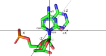

## Basepair Metrics{#sec:basepair-metrics}

The objective of this work is to find and compare decent measures of basepairing, so we shall finally specify what we are looking for.
The main qualities of the metrics are:

* Interpretability — can we easily tell what the number means, can we easily guess the number by looking at the 3D structure?
* Simplicity — the ideal metric is easy to define and calculate algorithmically.
* Stability — it should have low variance for good quality basepairs.
* Universality — it should have similar value or similar variance on different basepair types.
* Independence — it is advantageous, if the metric is empirically independent on the other metrics we want to use.

<!-- We need to define basepairs in such a way, that humans can easily understand the results of computer calculations. -->

It is important that humans can easily understand why the computer did or didn't assign a specific basepair, either for debugging the software or potentially for refining the molecular structures.
Thus, we want the metrics to be reasonably simple and interpretable.

In order to be useful, the metric must have a sharp enough distribution to help identifying the specific basepair class.
As an extreme example, we can easily rule out using the euler angles shown in @fig:euler-angles-bad-distribution, because the values may span the entire range of -180° ... +180°.

{#fig:euler-angles-bad-distribution}

### The Number of Parameters

If we assume that the molecules are not deformed, then we can describe the relative position of two bases by six numbers.
The standard basepair parameters (@sec:std-base-parameters) can be one such description — essentially, we only need three translation coordinates and three angles of relative rotation.
However, we may not be able to characterize all the basepair types using simple numeric ranges of this minimal set of parameters.

Additionally, we consider it more elegant to avoid “hard cuts” in the data distributions.
As Craig Zirbel said in one of our meetings, we would prefer to have gentle limits on many parameters, than few uncompromising cutoffs.
FR3D indeed performs very well regarding this — we didn't find a single unnatural looking line in any of our scatter plots and histograms.
Since each of gentle limits cuts out a small fraction of the potential basepairs, the exact value of the limits isn't as sensitive.
That makes it easier to set the limit and also allows us to share the same conditions across all classes of a given basepairing family.

<!-- Since we do not  -->
We would rather avoid more complex constraints than a set of one dimensional numeric ranges.
Generalizing the constraints into two or more dimensions is similar to inventing additional parameters by linearly combining the existing ones, except that the potential new parameter is easier to share across the ~120 basepair classes.

TODO trans + Yaw/Pitch/Roll demo image

### Hydrogen bond lengths and angles

A good starting point is simply measuring the distance between the atoms forming the hydrogen bonds.
Traditionally, we would measure a hydrogen bond between the hydrogen and the acceptor heavy atom.
Since the exact hydrogen positions are often unknown, we will instead only consider the distance between heavy atoms (oxygen, nitrogen, or carbon).
Despite the availability of many algorithms for completing PDB structures with the missing hydrogens, there are tricky cases where automatic the completion fails.
Specifically, some bases may hold a charge and thus have an additional hydrogen, or it may be in a tautomeric form where the hydrogens are on different atoms.
Although it isn't common, it is crucial in some basepair classes, and it is likely to be biologically relevant (TODO https://doi.org/10.1002/cphc.200900687 ?, TODO https://www.ncbi.nlm.nih.gov/pmc/articles/PMC97597/ ?). TODO cWH-A-G

In addition to the distance, we can simply determine an angle between the two heavy atoms and a third atom situated on each base.
Depending on if we select the third atom next to the acceptor or the donor, we get what we will call "Donor angle" or "Acceptor angle".
For consistency, we will always select the last neighbor when ordered lexicographically by PDB atom name.

<!-- fetch 3Lz0
select pair, 3Lz0 and (chain J and resi 21 or chain I and resi \-20) -->

Unfortunately, our problem isn't as simple as measuring few distances.
Even if set strict limits on them, we will still get many false positives.
As shown in figure [-@fig:cWW-GC-length-and-covalent-angles], an ideal cWW GC pair should have h-bond lengths of about 2.9 Å and all angles at about 120°.
We must allow some slack, as no ideal pair exists in reality — a 0.5 Å and 20° tolerance is quite conservative.
Yet, we still find a number of false positives similiar to the one shown in @fig:cWW-GC-false-positive-hbond-lengthsangles.
Toughening the limits slightly would dismiss this case, but we are already dropping many good examples, as anyone can try out in the
[basepairs.datmos.org](https://basepairs.datmos.org/#cWW-G-C/hb0_L=..3.4&hb0_DA=100..140&hb0_AA=100..140&hb1_L=..3.4&hb1_DA=100..140&hb1_AA=100..140&hb2_L=..3.4&hb2_DA=100..140&hb2_AA=100..140&baseline_ds=fr3d-f) web application.

{#fig:cWW-GC-length-and-covalent-angles}

{#fig:cWW-GC-false-positive-hbond-lengthsangles}

<!-- fetch 3Lz0
select pair, 3Lz0 and (chain J and resi 21 or chain I and resi \-20) -->

### Hydrogen bond planarity

After hydrogen bonds, the second most important feature of pairing bases is their coplanarity.
Coplanarity is not easily defined a single measure, but it essentially means that the planes of the two bases are not overly different.
One of our proposals is to measure how much do the hydrogen bonds deviate from the plane, as the counterexample from @fig:cWW-GC-false-positive-hbond-lengthsangles has almost perpendicular H-bonds to both of the planes.

First, we must obtain the base planes.
All common bases are planar in principle, but it might be slightly deformed both in reality and in PDB structures.
We thus find the best fitting plane according to the least squared distance.
The hydrogen bond — the line between the two heavy atoms is then projected onto the plane and the result is the angle between it and the projection.

Each base has its own plane, giving us two separate numbers, similar to the donor and acceptor angles.
We could name these parameters "Donor Plane Angle" and "Acceptor Plane Angle", but the conceptual relation to the hydrogens is unimportant, compared to the relation with the base planes.
We will therefore name it **"Left Plane Angle"** and **"Right Plane Angle"**, assuming the first base is placed on the left, as in left-to-right text.

{#fig:metrics-hbond2plane-4v9i-1-AA_479-AA_453}

### Plane to plane comparison

We have a number of options for comparing the relative orientation of the base planes.
The obvious choice is the angle between the planes, more specifically the angle between their normal vectors which we will call simply **Coplanarity angle**.
(TODO cite ten paper co posilala Helen?).
That does not capture the vertical distance, but also cannot distinguish "bent" from "twisted" basepairs.
In the language of the standard basepair parameters, there is a difference between having a large propeller or large buckle.

To discern this, we define two new parameters utilizing information about the pairing edge.
For each basepair class, we know which atoms form the hydrogen bonds and also the atoms which form the edge in the sense of Leontis-Westhof nomenclature.
The **Edge to plane distance** is the minimal distance of atoms in the first residue pairing edge to the plane of the second residue.
The **Edge to plane angle** is the angle between the line of first residue pairing edge and the plane of the second residue.
Each edge always has at least two atoms in RNA, allowing us to calculate the angle even if only one hydrogen bond is defined.
Both of these metrics depend on the order of bases.
The two **Edge to plane angles** are usually very similar, but **Edge to plane distances** might be very different, if the basepair is sufficiently "bent".
<!-- A symmetrical alternative would be to take center point of both edges, project it onto both planes the distance between the center -->

<!--
fetch 4v9i
select pair, 4v9i and chain AA and resi 479+453
show sticks, %pair
orient %pair
hide everything, not %pair-->

{#fig:metrics-edge2plane-angle-4v9i-1-AA_479-AA_453}

<!--
fetch 4dv6
select pair, 4dv6 and chain A and resi 1200+1055
show sticks, %pair
orient %pair
hide everything, not %pair-->

{#fig:metrics-edge2plane-distance-4dv6-1-A_1200-A_1055}

---

The above-mentioned measures already work very well on most basepair classes.
As described in @sec:TODO, we can verify that by calculating the parameters for all close contacts found in PDB and bounding them by the maximum range observed in basepairs reported by FR3D.
When we do that with the five H-bond parameters and the five coplanarity measures, we are able to reproduce the FR3D reported set to a decent degree.
For instance, in the cWW U-U class, we have about 60 false positives, out of 750 total basepairs.
Out of which, we claim that the vast majority of false positives are valid basepairs of this category, albeit slightly streched or shifted.
We would like to encourage the readers to [judge for themselves in the basepairs.datmos.org web application.](https://basepairs.datmos.org/#cWw-U-U/hb0_L=..4&hb0_DA=85..145&hb0_AA=95..155&hb0_OOPA1=-45..35&hb0_OOPA2=-45..60&hb1_L=..4.1&hb1_DA=85..140&hb1_AA=90..155&hb1_OOPA1=-40..35&hb1_OOPA2=-50..35&min_bond_length=..3.8&coplanarity_a=135..&coplanarity_edge_angle1=-30..45&coplanarity_edge_angle2=-35..45&coplanarity_shift1=-1.6..1.7&coplanarity_shift2=-1.1..1.5&baseline_ds=fr3d-f)

### Relative base rotation{#sec:basepair-metrics-ypr}

However, the weak spot of this approach are the basepair classes with only a single hydrogen bond.
Such a basepair is free to rotate along H-bonded atoms, as long as it is planar.
An example of this issue is shown in figure TODO.

TODO fig **A.** An example of a correctly assigned tHH A-G basepair. **B.** The tHH A-G candidates also includes a clear Watson-Crick/Hoogsteen basepair. The coplanarity is perfect and the N6 ··· O6 H-bond cannot distinguish it either, as it defined both of these two classes.

Again, the [web application demonstrates this issue interactively](http://localhost:1922/#tHH-A-G/hb0_L=..4&hb0_DA=100..150&hb0_AA=100..165&hb0_OOPA1=-25..35&hb0_OOPA2=-10..35&min_bond_length=..3.8&coplanarity_a=..40&coplanarity_edge_angle1=-10..25&coplanarity_edge_angle2=-10..30&coplanarity_shift1=-0.2..1.5&coplanarity_shift2=-0.3..1.3&baseline_ds=fr3d-f)

---

We can describe the relative rotation of two bases by three angular parameters -- either as a variant of [euler angles](https://en.wikipedia.org/wiki/Euler_angles), or as the angle of projected axes (similarly as in @sec:std-base-parameters).
In order to determine that, we need to define a coordinate system for each base.
Although the choice of coordinate system significantly affects the calculated angles, it has little impact on the variance and the exact values are irrelevant for our use case.
The choice of coordinate system is thus essentially arbitrary, and therefore we choose the simplest option.

The relative position of the pairing bases can be trivially described as the translation vector of the two coordinate systems, but this is already covered well by the hydrogen-bond parameters.

As suggested by Jiří Černý, we choose to place the origin in the N1 or N9 atom, align the glycosidic bond with negative Y axis, as illustrated in figure [-@fig:MMB_reference_frame-purinepluspyrimidine].
The C6 / C8 atom is placed in negative X with zero Z coordinate, uniquely determining the new coordinate system.
The coordinate system is similar to the used in [MMB (formerly RNABuilder)](https://doi.org/10.1109%2FTCBB.2010.104), except for that the X and Y axis are swapped and negated.
The modification was proposed by Craig Zirbel to roughly aligns the coordinate system with the one used in FR3D, as it conveniently places the Watson-Crick edge in positive X and Y coordinates.

We will calculate the **ZYX intrinsic Euler angles** between the coordinate systems.
It offers a good interpretability as the **Yaw**, **Pitch**, and **Roll** angles of an aircraft going from the first glycosidic bond to the second one, with the wings aligned along the base plane.
It is also easy to demonstrate or verify by three `turn` subsequent commands in PyMOL.

{#fig:MMB_reference_frame-purinepluspyrimidine}
