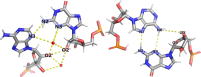

## Testing Basepair Parameters {#sec:testing-basepair-params}

To verify that the parameters proposed in [the previous section @sec:basepair-params] are sufficient to define basepairs, we will try to replicate FR3D annotations using them.
We deliberately use a different set parameter than FR3D (except for H-bond lengths), to ensure that this experiment yields sensible results.
Notably, compared to FR3D, we lack constraints on relative translation of the pairing bases.
Translational constraints are powerful, but because they are hard to generalize even across a single family, we simplify our model significantly by avoiding them.

We simply compute the parameters for all basepairs reported by FR3D and set the parameter boundaries to the observed minimum and maximum.
Then, we obtain all basepairs satisfying these constraints and examine the differences between this set and FR3D assignments.

The approach will, in principle, yield zero false negatives, but is sensitive to extremes in FR3D-annotated basepairs.
Instead of minimum and maximum, we used **0.001** and **0.999** quantiles to lessen the sensitivity.
We also extended the boundaries by rounding the minima down and maxima up.
H-bond lengths do not have a lower limit, and we always set the upper limit to 4 Å, or 4.2 Å in case of C-H bonds.
We set the 4 Å limit as [Jeffrey (1997)](https://archive.org/details/introductiontohy0000jeff) also identifies “weak, electrostatic” H-bonds up to 4 Å.
The strict limit also enables an efficient search for basepair candidates, for instance using [NeighborSearch in Gemmi](https://gemmi.readthedocs.io/en/latest/analysis.html).

[Table @tbl:fr3d-autoboundaries-comparison] shows the results for a selection of basepairing with over 500 samples on our reference set.
The _False negatives_ column shows the number of pair identified by FR3D, but not included by our scheme (i.e., _missed_); and _False positives_ is the opposite (i.e., _misidentified_).
We can see, that most classes are re-identified well enough and the few _misidentified_ or _missed_ percents are generally debatable “borderline basepairs”, hard to classify even manually.
To examine the individual differences we used the basepairs.datmos.org web application, as described in the next section.
<!--

The terms _false negative_ and _false positive_ are an overstatement, as we do not have a ground truth.

TODO: missing from FR3D / only in FR3D, not in FR3D / newly assigned

-->

<!--
family	bases	count_all	count_baseline	count_target	count_dropped	count_added	family_id	diff	diff_percent_p	diff_percent_n
cww	G-C	59610	57457	59327	283	2153	1	-283 +2153	-0.49%	+3.6%
cww	A-U	29412	28947	28893	519	465	1	-519 +465	-1.8%	+1.6%
cww	G-U	6302	5959	6300	2	343	1	-2 +343	-0.034%	+5.4%
ths	A-G	3372	3228	2856	516	144	10	-516 +144	-16.0%	+5.0%
css	A-C	2324	1586	2286	38	738	11	-38 +738	-2.4%	+32.0%
twh	U-A	2221	2127	2217	4	94	4	-4 +94	-0.19%	+4.2%
tss	A-G	2091	2091	2586	53	527	12	-32 +527	-1.5%	+20.3%
css	C-A	1966	1718	1920	46	248	11	-46 +248	-2.7%	+13.0%
cww	U-U	1529	1500	1528	1	29	1	-1 +29	-0.067%	+1.9%
cww	A-G	941	845	934	7	96	1	-7 +96	-0.83%	+10.0%
cwh	G-G	821	795	815	6	26	3	-6 +26	-0.75%	+3.2%
css	A-G	764	742	462	302	22	11	-302 +22	-41.0%	+4.8%
css	U-A	726	698	698	28	28	11	-28 +28	-4.0%	+4.0%
thh	A-A	709	689	707	2	20	8	-2 +20	-0.29%	+2.8%
css	G-A	689	641	593	96	48	11	-96 +48	-15.0%	+8.1%
tws	A-G	684	651	673	11	33	6	-11 +33	-1.7%	+4.9%
chh	A-G	605	539	604	1	66	7	-1 +66	-0.19%	+11.0%
chs	U-G	582	534	581	1	48	9	-1 +48	-0.19%	+8.3%
-->
|Basepair | FR3D count | _False negatives_ | _False positives_ | _FN_ rate | _FP_ rate |
|-------:|---------:|--------:|--------:|------:|------:|
| cWW G-C | 57457 | -283 | +2153 | -0.49%  | +3.6%  |
| cWW A-U | 28947 | -519 | +465  | -1.80%  | +1.6%  |
| cWW G-U | 5959  | -2   | +343  | -0.03%  | +5.4%  |
| tHS A-G | 3228  | -516 | +144  | -16.0%  | +5.0%  |
| cSS A-C | 1586  | -38  | +738  | -2.40%  | +32.0% |
| tWH U-A | 2127  | -4   | +94   | -0.19%  | +4.2%  |
| tSS A-G | 2091  | -32  | +527  | -1.50%  | +20.3% |
| cSS C-A | 1718  | -46  | +248  | -2.70%  | +13.0% |
| cWW U-U | 1500  | -1   | +29   | -0.07%  | +1.9%  |
| cWW A-G | 845   | -7   | +96   | -0.83%  | +10.0% |
| cWH G-G | 795   | -6   | +26   | -0.75%  | +3.2%  |
| cSS A-G | 742   | -302 | +22   | -41.70% | +4.8%  |
| cSS U-A | 698   | -28  | +28   | -4.01%  | +4.0%  |
| tHH A-A | 689   | -2   | +20   | -0.29%  | +2.8%  |
| cSS G-A | 641   | -96  | +48   | -14.98% | +8.1%  |
| tWS A-G | 651   | -11  | +33   | -1.68%  | +4.9%  |
| cHH A-G | 539   | -1   | +66   | -0.19%  | +11.0% |
| cHS U-G | 534   | -1   | +48   | -0.19%  | +8.3%  |

: Comparison of basepair counts as assigned by FR3D and by the procedure from @sec:testing-basepair-params. Only selection of basepair types with over 500 samples in the reference set (@sec:filter). {#tbl:fr3d-autoboundaries-comparison}

However, first, we need to explain and mitigate the major discrepancies, notably the missing cases of **cSS A-G**, **tHS A-G**, **cSS G-A**, and the misidentified ones in **cSS A-C**, **tSS A-G**, **cSS C-A**, and **cHH A-G**.<!-- maybe also cWW A-G -->
Essentially all _false negatives_ can be attributed to the 4 Å length limit on hydrogen bonds.
<!-- cite https://biomodel.uah.es/en/water/hbonds.htm? -->
Although a _real_ H-bond cannot be significantly longer than that, it is simply practical to not require this in every single case.
In the **cSS A-G** class, the issues lies in the **N3**···**O2'** H-bond, which often involves a water molecule as the basepair geometry contains a natural cavity (@fig:testing-missed-cases).
The **tHS A-G** class has a different issue with a **O2'** H-bond --- the glycosidic bonds may rotate, substituting O2' with O4' as the H-bond donor.
Strictly speaking, this behavior defies the **tHS A-G** class definition, but we want to allow that, when it is fairly common and gentle “violation”.
**cSS G-A** is essentially the same case, a third, **O2'**-related H-bond is often missing, marking the entire basepair as invalid.

Marking the beginning of the _“clash with reality”_ project phase, our solution is to simply allow longer bonds in these three particular cases.
We proceed similarly in the remaining classes with a third **O2'**-related H-bond.
The adjustment brings the _false negative_ rate down to at most 12% (in **cSS A-G**, others are lower).
More importantly, the remaining false negatives again are from the “borderline basepair” camp.
The number of _false positives_ did not increase significantly, as the two other H-bonds sufficiently constrain the overall geometry.

{#fig:testing-missed-cases}

Classes with too many false positives are a tougher nut to crack.
The underlying issue in **cSS A-C**, **cHH A-G** and many other smaller classes is the lack of hydrogen bonds.
A single H-bond does not provide enough spatial constraint on the relative position, and the same problem occurs when both H-bonds involve a single **O2'** atom.
We intend to solve this by adding a spatial distance constraint (a “virtual H-bond”), for instance, ensuring that the six-membered rings do not drift too far apart.

In the case of **cSS C-A** and **tSS A-G** classes, we would argue that the FR3D assignment is not the ideal target, and therefore, we do not intend to match it perfectly.
The current disparity is not substantial (20%), but our _“false positives”_ often look better than other basepairs identified by FR3D.
It is hard to demonstrate which assignment looks better without multiple pages of figures, and we unfortunately do not have an objective way of comparing the assignments.
The differences may be examined manually in the application, when we enable FR3D comparison after selecting the [**tSS A-G**](https://basepairs.datmos.org/#tSs-A-G/ds=allcontacts-boundaries-f&baseline_ds=fr3d-f) or [**cSS C-A**](https://basepairs.datmos.org/#cSs-C-A/ds=allcontacts-boundaries-f&baseline_ds=fr3d-f) class.

<!-- but figure TODO shows a single example of a _"good false positive"_ and one example of a _"good false negative"_. -->
