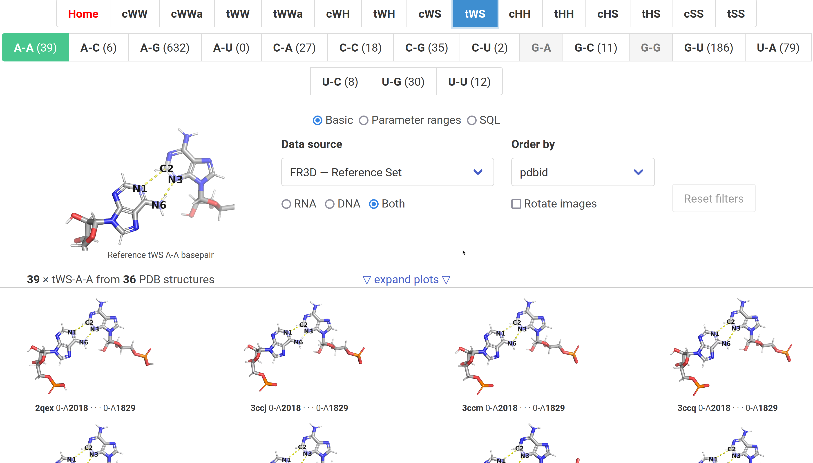
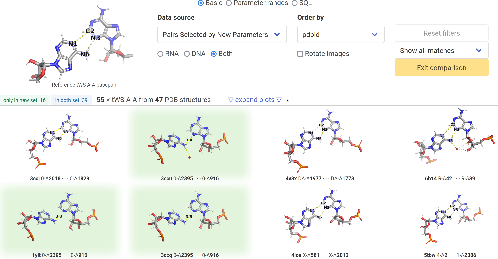
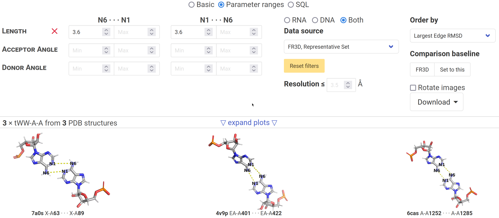

## Interactive Web Application for Parameter Tuning {#sec:tuning-app}

In [the preceding section @sec:testing-basepair-params], we have seen how each class of basepairs behaves somewhat differently.
We have the need to assess the individual differences in the assignments and allow us to tune the allowed boundaries in each basepairing family.
<!-- Moreover, it is far from ideal to establish different selection criteria for each class, based on the FR3D observations, the approach was only fit as a proof of concept.
Instead, we would prefer to get simpler model, ideally with shared limits for most classes or within each basepairing family.
This requires a significant amount of manual effort in selecting appropriate boundaries for each parameter in each class.
Therefore, we need a tool to speed up: -->

<!-- 1. Exploration of individual instances of each basepair class.
2. Compare the differences between basepairs assigned by FR3D and by a set of our selection criteria;
3. And finally, interactively tuning the selection criteria. -->

The application which answers these requests to a certain extent is running at [basepairs.datmos.org](https://basepairs.datmos.org){.link-no-footnote} (and is attached to the thesis).
This section outlines the basic use cases, while notes about implementation can be found in @sec:impl-webapp.
It should be noted that it was developed primarily as a tool for internal use, with more emphasis on flexibility and comprehensive functionality than a gentle learning curve.
Also note that the application is rather gluttonous when it comes to network bandwidth and system memory (it runs the database in the browser).

### Browsing basepairs

Upon first visit, we are greeted with a home page listing all basepair classes in a table format, reminiscent of <https://doi.org/10.1093/nar/gkf481>.
We are expected to select a class of interest, either by clicking a cell in the table, or using the menu at the top of the screen.

When viewing a specific class, we should select the desired "**Data Source**" -- let us select "**FR3D -- Reference Set**" for this demonstration.
As shown in @fig:screenshot-app-fr3dpairs, this displays images of all basepairs of the selected class which were reported by FR3D on the Reference Set (@sec:filter).
If we are looking for the most typical cases, we should switch "**Order by**" to the "**Smallest Edge RMSD**".
The edge RMSD is the distance to the most typical basepairs (@sec:opt-params-exemplar), computed as the mean distance of edge (@sec:bp-terminology-lw) atoms, when aligned on all atoms of the second nucleobase.

{#fig:screenshot-app-fr3dpairs}

{#fig:screenshot-app-modal-fr3dpair}

If the reference set is too small, we have the option to select "FR3D -- Entire PDB".
However, since the basepair images need to be pre-generated, the application will now mostly show white squares in their place.
Regardless, we can click on any basepair to display detailed description, first part of which is shown in @fig:screenshot-app-modal-fr3dpair.

* Identity of the basepair (PDB structure ID, chains, residue numbers).
* Two images from different angles if it was pre-generated.
* A [PyMOL](https://github.com/schrodinger/pymol-open-source) script which displays the pair, when pasted to PyMOL command line. It may be used to display basepairs for which the image did not load.
* The calculated parameters (@sec:basepair-params) with a short description.

### Comparing sets

When we switch to the **Pairs Selected by New Parameters** data source, we get the option to "**Enable FR3D Comparison**".
As shown in @fig:screenshot-app-comparison-tWS-AA, we get a union of the basepairs returned by FR3D and the set returned by our proposed criteria.

If the data is still **Ordered by** the **Smallest Edge RMSD**, the screen is unlikely to display interesting cases.
To see the disparities, we can either switch to **Largest Edge RMSD** or select the **Show only differences** option, instead of **Show all matches**.
Pairs annotated by FR3D and not annotated by our new system are highlighted _red_, while the ones reported exclusively by us are highlighted in _green_ (the positive connotation of green).

{#fig:screenshot-app-comparison-tWS-AA}

At the time of writing and submission of the thesis, the criteria are still subject to change and are dynamically loaded from a shared Google Sheet.
The final results will likely be different from the ones presented here.

### Filtering basepairs

To examine the behavior of the parameters from @sec:basepair-params, we can switch from **Basic** to **Parameter Ranges**, and try filtering out basepairs with certain parameter values.
A frequent request is to see whether we should include basepairs with overly stretched H-bonds -- given that such an interaction typically exhibits [minimal energies at 4.0 Å](https://archive.org/details/introductiontohy0000jeff):

Firstly, the website remembers its state when navigating to another basepair class (selected data source, filters, comparison are kept), but the state can be reset at any time by clicking the **Home** button in the top menu.
We can select any populated class of basepairs, and switch to **Parameter Ranges**, prompting the display of several numeric input fields.
For each defined H-bond, we get a column of input fields, with a row for each parameter; each cell represents the minimum and maximum allowed value.
Our focus is on the first row, which controls the limits on distance between heavy atoms.
To find the _bad_ examples, we set the minimum to 3.6 Å, a threshold for instance used in PyMOL default settings.
Typically, only a small fraction of basepairs have all H-bonds >= 3.6 Å, but in @fig:screenshot-app-hb-filters we received three cases in the reference set for the **tWW A-A** class.
Upon inspection, two of these look arguably borderline, while one case is surprisingly well-structured.

{#fig:screenshot-app-hb-filters}

### Editing the criteria

Most importantly, the application enables interactive editing of the selection criteria.
For demonstration, we can try to improve (or impair) the annotation of the **cWH C-C** class.
Firstly, we will reset the current state, navigate to **cWH C-C**, switch to **Parameter Ranges**, and select **Pairs Selected by New Parameters** data source.
Subsequently, we set the comparison baseline to **FR3D** assignments, and click on **Edit the selection boundaries**.
By this action, the data source switches to **All Contacts**, and filtering ranges get populated with pre-defined limiting values from the Google Sheet.

Given the limited number of **cWH C-C** examples in the reference set, we can see all basepairs without excessive scrolling.
If we have the dataset ordered by the **Largest RMSD**, the most anomalous cases should appear first.
In the current version, the set includes basepairs that significantly deviate from the optimal coplanarity.
To mitigate this issue, we can tighten the edge-to-plane distance constraint from 2.0 Å to 1.7 Å.
This constraint refinement successfully removes the most misguided assignments, while leaving in a number of reasonably well-looking _green_ pairs.

