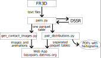

## RNA basepair processing scripts

### Setup

* Install Python (>=3.11) and [python-poetry](https://python-poetry.org/).
* Run `poetry install` (in this `/scripts` directory)
* Scripts which do not depend on PyMOL should now run using `poetry run ...`. For example:
    - `poetry run python3 ./pairs.py 1EHZ_basepair.txt --output 1ehz_params.csv` - calculates all implemented parameters for all basepairs found by FR3D
    - `poetry run python3 ./pairs.py *_basepair.txt --output all_params.csv --pdbcache /downloads/structures/into/here` - same, but for many structures with a cache directory
    - `poetry run python3 ./pair_distributions.py --skip-image --output-dir out/ all_params.csv.parquet` - generates plots and basic stat files into the out/ directory
    - `poetry run python3 ./pair_distributions.py --skip-image --reexport=partitioned --output-dir out/ all_params.csv.parquet` - same, plus export basepair tables partitioned by the class with KDE-based niceness columns (needed for the webapp)
* The environment includes IPython, Jupyter kernel can be set up using `poetry run python -m ipykernel install --user --name {name} --display-name "Python ({name})"`
* The `gen_contact_images.py` (and `pair_distributions.py` without `--skip-image`) requires PyMOL, which is not on PyPI and therefore cannot be installed by Poetry.
    * PyMOL probably needs to be installed system-wide, other packages can then be in non-poetry virtualenv when `--system-site-packages` is used.
    * Since the exact installation process depends on the OS/distribution, it is left as an *excercise to the reader* (hint: in Czechia, good place to get the sacrifice animals is [bazos.cz](https://zvirata.bazos.cz/koza/), young goats seem to be Python favorites)
    * If you only need `gen_contact_images.py` without the integration into histograms, it is maybe sufficient to install `polars` and `numpy` system-wide.

### Usage

The following figure summarizes the data flow through the different scripts.



All script will output some documentation when started with the `--help` flag.

### List of executable files

Main scripts:

* `assign_in_structure.py`: Annotates basepairs in a given structure (performs the following steps at once)
* `pair_finding.py`: Finds near contacts in PDB structures — outputs any pairs which have atoms closer than 4.0 Å
* `pairs.py`: Annotates pairs with the parameters
* `apply_filter.py`: Filters pairs which satisfy the definitions in parameter-boundaries.csv
* `compare_sets.py`: Compares two assignments — two sets of pairs. Outputs statistics on how many pairs are added/removed in each class, and optionally the list of individual added/removed pairs.
* `pair_distributions.py`: Calculates KDE likelihoods for each class, annotates files with KDE likelihoods and mode deviations, selects “best basepair” in each class, outputs PDFs with histograms.

Other utilities:

* `ccsv.py`: Converts Parquet or CSV table into a “columnar CSV” — a directory with line separated files for each column.
* `gen_contact_images.py`: Generates PNG images of basepairs using PyMOL.
* `simulate_fr3d_output.py`: Converts the Parquet table to FR3D-like text files.


### Example commands

All commands should be prefixed with `poetry run python`, or `/path/to/venv/bin/python`.

Most script either take path to mmCIF files, or they accept PDB ID and download the files themselves. To avoid repeated downloads, `--pdbcache=/path/to/pdbcache` may be specified. The PDB cache can even be multiple directories — all are used for lookup, but only the last one will be modified if the structure isn't found.

#### `assign_in_structure.py`

Annotate pairs in a given structure (output all supported file formats)

```sh
assign_in_structure.py ./1bna.cif --out ./outdir/
```

Annotates pairs in a large set of structures

```sh
assign_in_structure.py ~/pdb/**/*.cif --out ./outdir/ --threads=100% --format=parquet
```

#### `pair_finding.py`

Find all contacts under 4.0 Å in a large set of structures - given by PDB IDS

```sh
python pair_finding.py $(cat ./pdbids.lines) --pdbcache ~/pdbcache --output ./pairf-output/ --distance 4.0 --threads 100%
```

#### `pairs.py`

Annotate basepairs from FR3D using our parameters. Please, run FR3D with the `-c basepair_detail` option. `--reference-basepairs` is a list of example pairs used for RMSD calculation, which may be obtained from the `pair_distribution.py` output.

```bash
pairs.py ./fr3d-output/*_basepair_detail.txt \
    --pdbcache ~/pdbcache \
    --threads 100% \
    --dedupe \ # only keep one orientation of each pair
    --reference-basepairs ./pair_distributions.py-output6/output.json \ # optional, from pair_distributions.py
    --output ./out/fr3d-pairs.parquet
```

Annotate pairs from pair_finding.py. 

```bash
pairs.py\
    --override-pair-family=all\ # pairs do not have a family column, we want to calculate parameters for each pair in each family
    --filter --dedupe\
    --postfilter-hb=4.2 --postfilter-shift=2.5\ # require that all pairs have at least one 4.2 Å H-bond, and |shift| < 2.5Å
    --pdbcache ~/pdbcache\
    --threads=100%\
    --output=./out/all.parquet\
    pairf-output/*.parquet\
    --partition-input-select=0-32/32 # run in batches of N/32 to lower memory usage
```

#### `apply_filter.py`

Apply the filter based on the Google Sheets table (updated in near-realtime).
The `--best-fit=single-pair` is used to select only one classification for each pair of nucleotides.
The parameter is optional (or can be specified `=none`) to avoid this filtering step.

```bash
apply_filter.py out/all.parquet -o "out/assignment.parquet" --best-fit=single-pair
```

#### `compare_sets.py`

Compare "our assignment" with FR3D, producing a summary CSV and a Parquet list of all nucleotides with added `comparison_in_baseline` and `comparison_in_current` columns.
For easy alignment in Excel, the boundaries CSV can be specified using `--boundaries` to make sure the order of classes remains the same.

```bash
compare_sets.py --baseline out/fr3d-pairs.parquet --target out/assignment.parquet -o out/comparison-stats.csv --output-full-diff out/comparison-list.parquet
```

> Note that the comparison does not take into account non-standard nucleotides, as those were filtered out in `pairs.py` in both cases.

#### `gen_contact_images.py`

Generate images for a single annotated structure. For easy comparison, the basepairs will have the right glycosidic bond aligned with Y axis (`--standard-orientation=True`), and will be in orthoscopic projection instead of perspective (`--ortho`).

```bash
gen_contact_images.py outdir/1bna.parquet --output-dir=outdir/1bna-img --standard-orientation=True --ortho
```

Generate images for a large set of pairs.
Using `--incremental=True --incremental-max-age=100` we set it to generate only those images, which are not already generated, or are older than 100 days.
`--niceness=15` gives the process low priority, as it will presumably run for a long time.

```bash
gen_contact_images.py out/assignment.parquet --output-dir=outdir/all-img --threads=50% --standard-orientation=True --niceness=15 --incremental=True --incremental-max-age=100
```

Generate rotating movies for a set of basepairs, with the length of 120 frames.
We will also allow up to 3 encoding processes running in the background for each rendering thread (VP9 is slooow...)

```bash
gen_contact_images.py outdir/1bna.parquet --output-dir=outdir/1bna-vid --standard-orientation=True --movie=120 --ffmpeg_background=3
```
